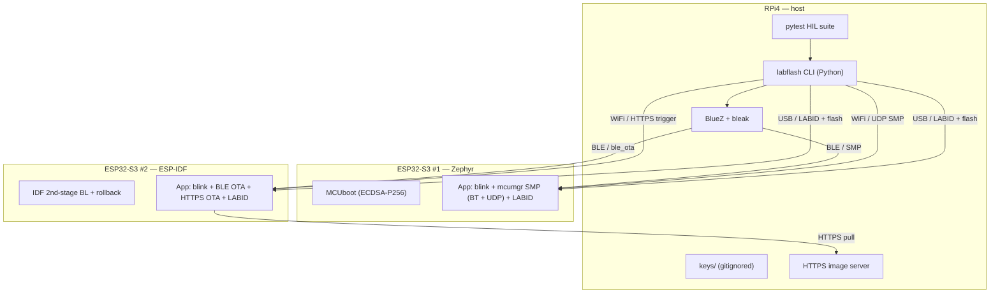
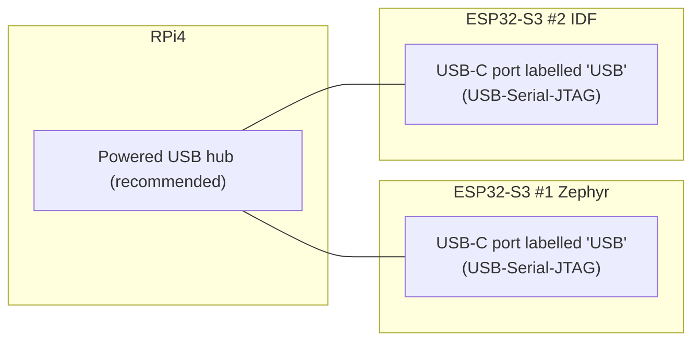
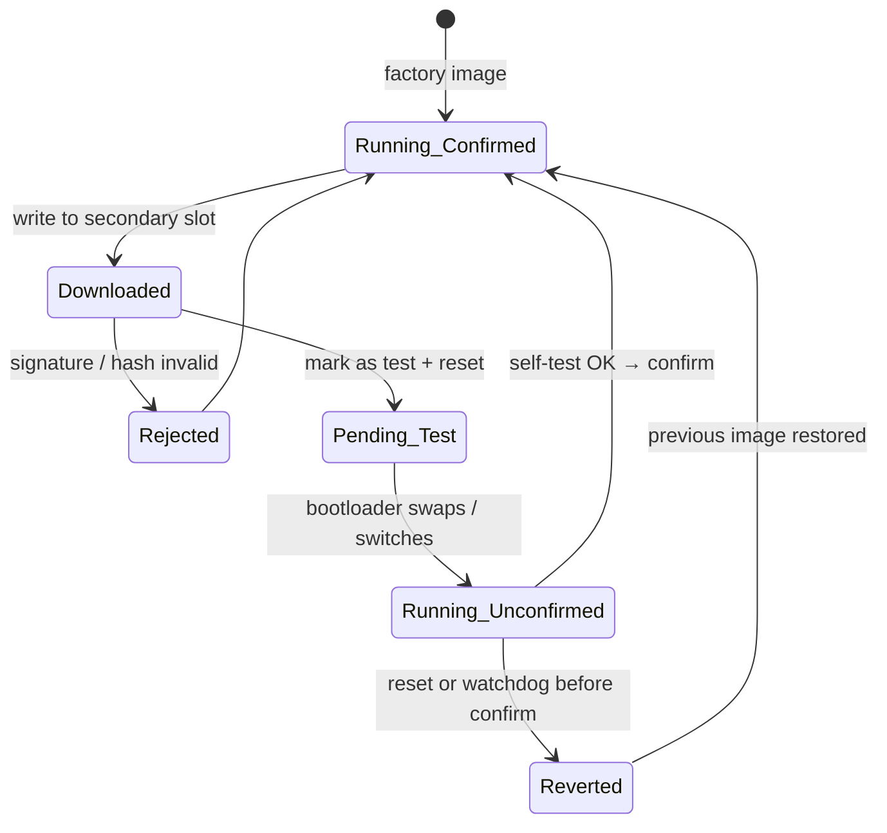
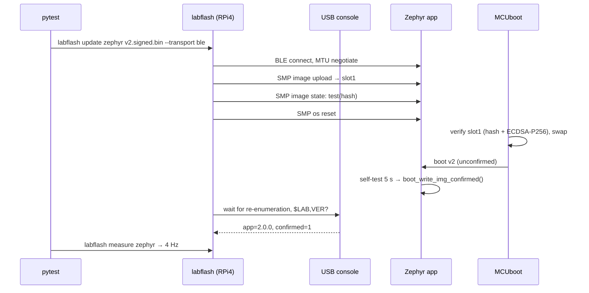
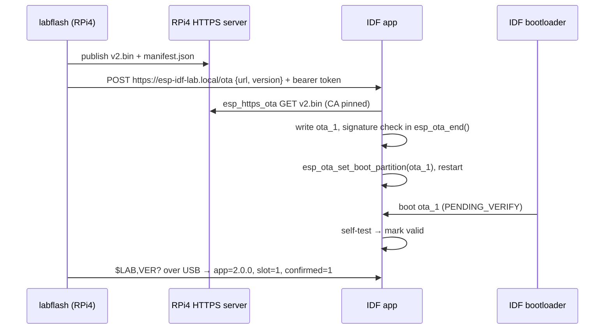
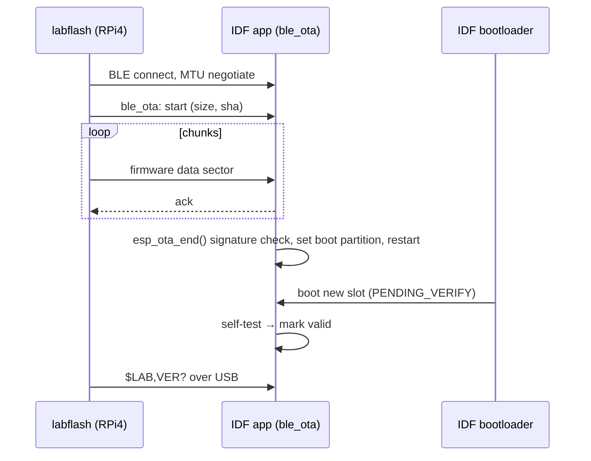
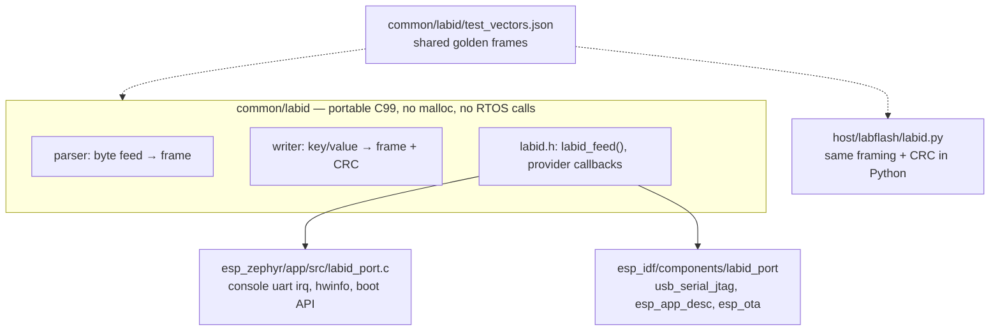
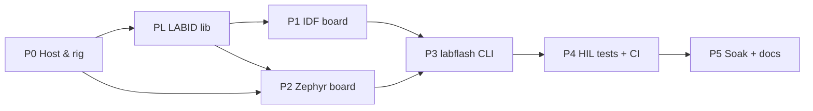
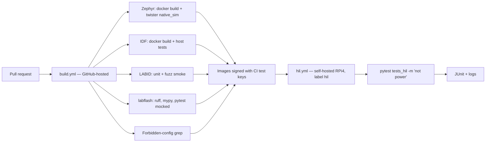

# ESP32-S3 Bootloader & OTA Lab — Implementation Plan (ESP-only)

> Audience: an autonomous AI coding agent. Follow phases in order.
> Every phase ends with **acceptance criteria** that must pass before moving on.
> Owner: Mohamed. Host: RPi4 (`msa-linuxRPi4`, user `msa`).
> **Execution is tracked in `tickets/`** (47 tickets, 7 epics). Run `python3 tickets/tickets_tool.py next`.
> Scope note: the Nano 33 BLE Sense Rev2 was removed from this plan. It can be added later as a separate project (`docs/adding-a-board.md`).

---

## 0. Goal

Two ESP32-S3 boards, two software stacks, two bootloaders. Each board ships with a
**default LED-blink app**. The RPi4 updates both boards **over BLE and WiFi** with
**signed images** and **automatic rollback**. Each board **identifies itself and its
software versions** over USB serial. A **HIL test suite** on the RPi4 proves it all works.

### 0.1 Locked decisions

| # | Topic | Decision |
|---|---|---|
| D1 | ESP32-S3 #1 | **Zephyr** + MCUboot (sysbuild) + mcumgr/SMP |
| D2 | ESP32-S3 #2 | **ESP-IDF** (built-in FreeRTOS) + IDF 2nd-stage bootloader + OTA partitions |
| D3 | Transports | **Both** boards update over **BLE and WiFi** |
| D4 | Security | **Signed images + failure rollback**. No encryption, no eFuse burning |
| D5 | Update protocols | Native per platform: SMP (Zephyr), `ble_ota` + `esp_https_ota` (IDF) |
| D6 | Board identity | **LABID** serial protocol: self-announce + query board, UID, all SW versions (§7.3) |
| D7 | Dev connections | **USB only**: one USB-C cable per board. **Zero extra wires** |

### 0.2 Non-goals

- No flash encryption, no hardware Secure Boot, no eFuse writes of any kind.
- No anti-rollback (version floor). Only **failure rollback**.
- No cloud. Everything stays on the home LAN and the RPi4.
- No application features beyond LED blink + version report + health confirm.

---

## 1. System architecture



### 1.1 Per-board summary

| | ESP32-S3 #1 | ESP32-S3 #2 |
|---|---|---|
| OS | Zephyr | ESP-IDF / FreeRTOS |
| Bootloader | MCUboot | IDF 2nd-stage bootloader |
| BLE update | SMP over Zephyr BT | Espressif `ble_ota` (esp-iot-solution) |
| WiFi update | SMP over UDP (push) | `esp_https_ota` (pull from RPi4) |
| Signature | ECDSA-P256 (imgtool) | Secure Boot V2 scheme, *verification only, no eFuse* |
| Rollback | MCUboot test/confirm + watchdog | `APP_ROLLBACK_ENABLE` + task watchdog |
| Connection | USB-Serial-JTAG | USB-Serial-JTAG |
| Identity + versions | LABID on USB console | LABID on USB console |
| First flash + recovery | USB (ROM download mode) | USB (ROM download mode) |

---

## 2. Hardware & HIL rig

### 2.1 Connections



| Board | Cable | Carries |
|---|---|---|
| ESP32-S3 #1 | 1 × USB-C on the **"USB"** port (not "UART") | Power, flash, console, LABID, reset, optional JTAG |
| ESP32-S3 #2 | 1 × USB-C on the **"USB"** port | Power, flash, console, LABID, reset, optional JTAG |

- Total: **2 USB cables, 0 wires**.
- **Unbrickable:** the ESP32-S3 ROM bootloader is in mask ROM. If an app breaks USB, hold **BOOT**, tap **RESET**,
  then flash over USB again.
- Optional debugging: OpenOCD-esp32 over the same USB cable (built-in USB-JTAG).

### 2.2 Telling two identical boards apart

- Both boards enumerate with the **same VID:PID** (Espressif USB-Serial-JTAG).
- They differ only in the **USB serial number** (derived from the chip MAC).
- udev symlinks by serial: `/dev/lab-esp-zephyr`, `/dev/lab-esp-idf`.
- The source of truth is **LABID `ID.uid`**. If someone swaps the cables or flashes the wrong board,
  `labflash identify` detects it (`board=` field vs `rig.yaml`).

### 2.3 Blink verification (no wires)

- Every app keeps a **`toggles` counter** (incremented on each LED toggle), exposed in `LABID STATE`.
- `labflash measure <board>`: read `STATE` → wait N s → read `STATE` → `hz = Δtoggles / (2·Δt)`.
- Pass: within **± 1 toggle** of expected over a 5 s window.
- Accepted trade-off: the firmware reports on itself; no independent physical measurement.

### 2.4 Host setup items

- **Powered USB hub** recommended: two ESP32-S3 WiFi TX peaks can exceed the RPi4 USB budget.
- **Re-enumeration:** every reset makes the port disappear and return, and `ttyACMx` may change.
  Host code resolves ports **by serial/UID** and waits up to 5 s after any reset.
- BlueZ up to date; user `msa` in groups `bluetooth`, `dialout`, `plugdev`.
- mDNS (`avahi`) so the IDF board resolves `msa-linuxRPi4.local`.
- **Do not weaken** existing hardening (SSH key-only, fail2ban, AppArmor, sysctl).

### 2.5 Board LEDs

| Board | LED | Notes |
|---|---|---|
| ESP32-S3-DevKitC-1 | Addressable RGB (WS2812) on GPIO48 **or** GPIO38 | Depends on board revision → detect in P0 |

---

## 3. Repository layout

```
bootlab-esp/
├── PLAN.md                     ← this file
├── README.md
├── tickets/                    ← tickets.json (source), TICKETS.md (generated), tickets_tool.py
├── west.yml                    ← Zephyr manifest (pinned)
├── .gitignore                  ← must ignore keys/, backups/, build/, *.pem
├── keys/                       ← generated on RPi4, never committed
├── backups/                    ← original flash dumps, never committed
├── common/
│   ├── VERSION                 ← single source of app version numbers
│   └── labid/                  ← LABID lib (C99) + test_vectors.json
│       ├── include/labid.h
│       ├── src/                ← parser, writer, crc16
│       ├── tests/              ← Unity tests + fuzz target
│       ├── zephyr/module.yml   ← Zephyr module packaging
│       └── idf_component.yml   ← IDF component packaging
├── esp_zephyr/
│   ├── app/                    ← prj.conf, boards/*.overlay, src/
│   ├── sysbuild.conf
│   └── tests/                  ← twister (native_sim)
├── esp_idf/
│   ├── main/
│   ├── components/labid_port/
│   ├── partitions.csv
│   ├── sdkconfig.defaults
│   └── test/                   ← host (linux target) + Unity tests
├── host/
│   ├── pyproject.toml
│   ├── labflash/               ← CLI package (incl. labid.py)
│   ├── config/rig.yaml
│   └── udev/
├── tests_hil/
│   ├── conftest.py
│   ├── test_boot.py
│   ├── test_update.py
│   ├── test_rollback.py
│   ├── test_security.py
│   ├── test_identity.py
│   └── test_robustness.py
├── scripts/                    ← versions.env, check_env.sh, gen_keys.sh, build_all.sh
├── docs/                       ← recovery.md, adding-a-board.md
└── .github/workflows/          ← build.yml (cloud), hil.yml (self-hosted RPi4)
```

---

## 4. Flash layouts

### 4.1 ESP32-S3 #1 — Zephyr + MCUboot

- Start from the board DTS `partitions` for MCUboot: `boot_partition`, `slot0_partition`,
  `slot1_partition`, `scratch_partition`, `storage_partition`.
- If default slots are too small for a BT + WiFi app: add `app/boards/<board>.overlay` with resized partitions.
- Record the final addresses here after P2.

### 4.2 ESP32-S3 #2 — ESP-IDF (`partitions.csv`, 16 MB flash — confirmed in P0)

| Name | Type | SubType | Offset | Size |
|---|---|---|---|---|
| nvs | data | nvs | 0x9000 | 0x6000 |
| otadata | data | ota | 0xF000 | 0x2000 |
| phy_init | data | phy | 0x11000 | 0x1000 |
| ota_0 | app | ota_0 | 0x20000 | 0x400000 |
| ota_1 | app | ota_1 | 0x420000 | 0x400000 |
| storage | data | spiffs | 0x820000 | 0x7E0000 |

- Both boards: ESP32-S3 (QFN56) rev v0.2, 16 MB quad flash, 8 MB embedded PSRAM (verify octal mode in boot log; if octal, GPIO35–37 are reserved).
- `CONFIG_PARTITION_TABLE_OFFSET=0x8000`.

---

## 5. Boot, update and rollback flows

### 5.1 Image state machine (both boards)



### 5.2 Self-test before confirm

- RTOS ticking for ≥ 5 s.
- LED toggled ≥ 5 times (`toggles` counter).
- BLE and WiFi stacks initialized without error.
- Then confirm:
  - Zephyr: `boot_write_img_confirmed()`
  - IDF: `esp_ota_mark_app_valid_cancel_rollback()`

### 5.3 Build variants (both boards)

| Variant | Behaviour | Used by |
|---|---|---|
| `v1` | Blink 1 Hz, confirms | Factory image, downgrade tests |
| `v2` | Blink 4 Hz, confirms | Upgrade tests |
| `no_confirm` | Blinks, never confirms | Rollback tests |
| `hang` | Blocks all tasks after boot → **watchdog reset within 10 s** | Watchdog rollback tests |
| `bad_sig` | Signed with the wrong key | Security tests |

- Zephyr: hardware watchdog enabled (`CONFIG_WATCHDOG`, `CONFIG_TASK_WDT` with HW fallback).
- IDF: `CONFIG_ESP_TASK_WDT_PANIC=y` so a hang resets the chip (→ rollback in `PENDING_VERIFY`).

### 5.4 OTA sequence — Zephyr over BLE (SMP)



### 5.5 OTA sequence — ESP-IDF over WiFi (pull)



### 5.6 OTA sequence — ESP-IDF over BLE



---

## 6. Security & keys

| Board | Key type | Generate | Sign |
|---|---|---|---|
| Zephyr | ECDSA-P256 | `imgtool keygen -k keys/zephyr_p256.pem -t ecdsa-p256` | sysbuild `SB_CONFIG_BOOT_SIGNATURE_KEY_FILE` |
| IDF | Secure Boot V2 scheme (RSA-3072 unless the pinned IDF supports ECDSA on S3) | `espsecure.py generate_signing_key --version 2 --scheme rsa3072 keys/idf_sbv2.pem` | automatic in `idf.py build` |

Rules:

- **Separate key per board.** Keys are **lab/dev keys**; README must say so.
- `keys/` gitignored. `scripts/gen_keys.sh` refuses to overwrite existing keys.
- IDF config (signature verification **without** Secure Boot, no eFuse writes):
  - `CONFIG_SECURE_SIGNED_APPS_NO_SECURE_BOOT=y`
  - `CONFIG_SECURE_SIGNED_ON_UPDATE_NO_SECURE_BOOT=y`
  - `CONFIG_SECURE_BOOT=n`, `CONFIG_SECURE_FLASH_ENC_ENABLED=n`
  - `CONFIG_BOOTLOADER_APP_ROLLBACK_ENABLE=y`, `CONFIG_BOOTLOADER_APP_ANTI_ROLLBACK=n`
- Zephyr MCUboot: signature checked by the bootloader in software only; no ESP hardware Secure Boot, no flash encryption.
- IDF WiFi OTA control endpoint: HTTPS, self-signed CA generated on the RPi4 and pinned in the app, bearer token stored in NVS.
- Zephyr UDP SMP has no authentication → **lab-only**, documented in README.
- CI signs with separate **CI test keys** (encrypted secrets). Lab keys stay on the RPi4.

---

## 7. Protocols

### 7.1 SMP (Zephyr)

- GATT service `8D53DC1D-1DB7-4CD3-868B-8A527460AA84`, characteristic `DA2E7828-FBCE-4E01-AE9E-261174997C48`.
- UDP transport port **1337**.
- Groups used: OS (echo, reset), Image (state read/write, upload).
- Host client: maintained Python SMP client library (verify the best option at P3), fallback Go `mcumgr`.

### 7.2 ESP-IDF BLE OTA + HTTPS OTA

- BLE: `ble_ota` component from esp-iot-solution (component manager, pinned). NimBLE host
  (`CONFIG_BT_NIMBLE_ENABLED=y`). RPi4 client implements the component's documented protocol in `host/labflash/idf_ble_ota.py`.
- WiFi + BLE coexistence: `CONFIG_ESP_COEX_SW_COEXIST_ENABLE=y`.
- HTTPS control API on the device:

| Method | Path | Body / result |
|---|---|---|
| `POST` | `/ota` | `{url, version}` + `Authorization: Bearer <token>` → `202`, starts pull |
| `GET` | `/version` | `{app, git, slot, confirmed}` |

### 7.3 LABID — serial identity protocol

Each board **describes itself** over the USB console: board, unique ID, all software versions, runtime state.

#### 7.3.1 Frame

```
$LAB,<TYPE>,<key>=<value>,...*<CRC16>\n
```

- Starts with `$` at line start; normal logs never start with `$`. Host ignores non-frames.
- CRC-16/CCITT-FALSE (poly 0x1021, init 0xFFFF) over the bytes between `$` and `*`, 4 uppercase hex.
  Check value `CRC("123456789") = 29B1`. Example: `$LAB,ID?*F9E6`.
- Device → host: CRC always. Host → device: CRC optional (human-typable in a terminal).
- Max frame **200 bytes**. Keys `[a-z0-9_]`, values `[A-Za-z0-9._:-]`.
- Parsers ignore unknown keys. Removing/renaming a key bumps `proto`.

#### 7.3.2 Messages

| Direction | Request | Response | Purpose |
|---|---|---|---|
| dev → host | *(once per boot, ≤ 2 s)* | `ANNOUNCE` | Board introduces itself |
| host → dev | `$LAB,HELLO` | `HELLO,proto=1` | Handshake |
| host → dev | `$LAB,ID?` | `ID` | Identity |
| host → dev | `$LAB,VER?` | `VER` | Software versions |
| host → dev | `$LAB,STATE?` | `STATE` | Runtime state |
| host → dev | `$LAB,PING,n=<u32>` | `PONG,n=<u32>` | Link test |
| dev → host | *(bad request)* | `ERR,code=<c>` | Error |

#### 7.3.3 Fields

| Frame | Key | Zephyr source | IDF source |
|---|---|---|---|
| ANNOUNCE | `proto`, `board`, `uid`, `app` | — | — |
| ID | `board` | `zephyr` | `idf` |
| ID | `hw` | `esp32s3_devkitc` | `esp32s3_devkitc` |
| ID | `mcu` | `esp32s3` | `esp32s3` |
| ID | `uid` (12 hex) | `hwinfo_get_device_id()` | `esp_efuse_mac_get_default()` |
| ID | `os` | `zephyr-<ver>` | `idf-<ver>` |
| ID | `flash_kb` | detected | detected |
| VER | `bl` | MCUboot version via bootloader info (retention) or `unknown` | `esp_bootloader_get_description()` |
| VER | `app` | `common/VERSION` → `app_version.h` | `esp_app_get_description()->version` |
| VER | `git` | build define (7 chars) | build define |
| VER | `build` | UTC `YYYYMMDDTHHMMZ` | same |
| VER | `variant` | `v1` `v2` `no_confirm` `hang` `bad_sig` | same |
| VER | `slot` | `0` after swap | `0`=ota_0, `1`=ota_1 |
| VER | `confirmed` | `boot_is_img_confirmed()` | `esp_ota_get_state_partition()` |
| STATE | `uptime_ms` | u32 | u32 |
| STATE | `reset` | normalized: `por` `pin` `wdt` `sw` `panic` `brownout` `other` | same |
| STATE | `blink_hz` | configured rate | same |
| STATE | `toggles` | u32 LED toggle counter | same |
| STATE | `rx_err` | rejected frames since boot | same |

Examples (real CRCs, reuse as golden vectors):

```
$LAB,VER,bl=1.0.0,app=2.0.0,git=9f3c2e1,build=20260916T1030Z,variant=v2,slot=0,confirmed=1*A8C7
```

| `ERR code` | When |
|---|---|
| `crc` | CRC present but wrong |
| `len` | Frame > 200 bytes |
| `syntax` | Not parseable |
| `unknown` | Unknown request type |

#### 7.3.4 Rules

- Response ≤ **100 ms**.
- Frames written **atomically** w.r.t. logs (single write under the console lock).
- RX overflow → drop until `\n`, increment `rx_err`, never reset.
- RX in driver/ISR → ring buffer → low-priority task. Never blocks the RTOS.
- Zephyr: shell **off** on the console (`CONFIG_SHELL=n`). IDF: read the USB-Serial-JTAG driver directly, not `stdin`.
- Bootloaders (MCUboot, IDF) do **not** speak LABID; only apps do.
- **Version consistency rule** (tested): `VER.app` == image version (imgtool `--version` / IDF app desc)
  == version from SMP image list / `GET /version`.

#### 7.3.5 Implementation



---

## 8. Phases



- **P1 and P2 are independent** and can run in parallel.
- **Do P2 step 1 first** (MCUboot swap-with-revert check on ESP32-S3): it is the biggest open risk.
- One branch + one PR per ticket. Merge only when acceptance passes.

---

### P0 — Host & rig setup

**Tasks**
1. Repo skeleton (§3). Pin Zephyr, IDF, MCUboot, esp-iot-solution `ble_ota` versions in `scripts/versions.env`
   (latest **stable** at start date).
2. Toolchains on RPi4: Python 3.11+, BlueZ, `west` + Zephyr SDK, ESP-IDF, `imgtool`, `esptool`.
3. Powered USB hub; udev symlinks by USB serial; groups; avahi.
4. **Back up both boards** (they currently run other firmware; it will be erased):
   `esptool.py read_flash 0 ALL backups/esp_<serial>.bin`.
5. Detect per board: flash size, PSRAM, board revision, RGB LED GPIO → `host/config/rig.yaml`.
6. `scripts/gen_keys.sh`.
7. `labflash doctor` stub.

**Acceptance**
- [ ] `scripts/check_env.sh` prints all tool versions matching `versions.env`.
- [ ] `labflash doctor`: 2 ESP USB devices, BT adapter up, WiFi up.
- [ ] 2 backups exist, not in git.

---

### PL — LABID common library

**Tasks**
1. `common/labid`: parser, writer, CRC-16. C99, no malloc, fixed buffers, MISRA-friendly.
2. Provider callbacks: `get_id()`, `get_versions()`, `get_state()`, `write(buf, len)`.
3. `test_vectors.json` + Unity host tests + libFuzzer target.
4. `host/labflash/labid.py` tested against the **same** vectors.
5. Packaging: Zephyr module + IDF component.

**Acceptance**
- [ ] C and Python pass 100 % of vectors.
- [ ] 10 min fuzz, no crash or sanitizer error.
- [ ] Coverage ≥ 90 % line + branch.
- [ ] Builds for Zephyr `native_sim` and IDF `linux` target.

---

### P1 — ESP32-S3 #2: ESP-IDF

**Tasks**
1. Blink FreeRTOS task (`led_strip`), `toggles` counter, 5 variants (§5.3), task WDT panic.
2. `partitions.csv` (§4.2), `sdkconfig.defaults` (§6).
3. LABID port on USB-Serial-JTAG.
4. Self-test → `esp_ota_mark_app_valid_cancel_rollback()`.
5. WiFi credentials + token in NVS via `labflash provision idf`.
6. HTTPS control server `/ota`, `/version`.
7. `esp_https_ota` pull with pinned CA.
8. `ble_ota` + NimBLE + coexistence.

**Acceptance**
- [ ] USB flash v1 → `measure` 1 Hz, `ANNOUNCE` ≤ 2 s.
- [ ] WiFi OTA v1 → v2 → 4 Hz, `$LAB,VER?` shows `app=2.x slot=1 confirmed=1`.
- [ ] BLE OTA v2 → v1 → 1 Hz.
- [ ] `no_confirm` and `hang` → previous version after reset.
- [ ] `bad_sig` rejected in `esp_ota_end()`, old version keeps running.
- [ ] `idf.py efuse-summary` unchanged vs backup.

---

### P2 — ESP32-S3 #1: Zephyr

**Tasks**
1. `west.yml` pinned. `sysbuild.conf`: `SB_CONFIG_BOOTLOADER_MCUBOOT=y`,
   `SB_CONFIG_BOOT_SIGNATURE_TYPE_ECDSA_P256=y`, key file.
   **Verify** a swap mode with revert is supported on ESP32-S3. If only overwrite-only → **ESCALATE** before coding further.
2. Blink via LED strip driver (verify WS2812 backend), `toggles`, 5 variants, watchdog.
3. LABID port on the console device, shell off.
4. Self-test → `boot_write_img_confirmed()`. Twister `native_sim` tests with mocked boot API.
5. mcumgr SMP over BT.
6. WiFi STA + DHCP + SMP over UDP in the **same build** as BT.

**Acceptance**
- [ ] `west flash` MCUboot + v1 → 1 Hz.
- [ ] BLE SMP v1 → v2 → 4 Hz, image list confirmed == `$LAB,VER?`.
- [ ] UDP SMP v2 → v1.
- [ ] `no_confirm` and `hang` → reverted.
- [ ] `bad_sig` refused by MCUboot.
- [ ] BT + WiFi in one build. If impossible (RAM/coex): documented reason, two variants, **owner decides**.

---

### P3 — `labflash` CLI (Python, RPi4)

```
labflash doctor
labflash identify [--write]                     # LABID scan → board/port/uid map
labflash info     <zephyr|idf|all> [--json]     # ID + VER + STATE
labflash measure  <board> [--seconds 5]         # blink Hz from toggles
labflash build    <board|all> [--variant v1|v2|no_confirm|hang|bad_sig]
labflash flash    <board>                        # USB factory flash
labflash recover  <board>                        # erase + factory flash (guides BOOT button if needed)
labflash provision <board> --ssid X --psk-file F
labflash update   zephyr <image> --transport ble|udp
labflash update   idf    <image> --transport ble|wifi
labflash status   <board|all>                   # LABID vs SMP / GET /version cross-check
```

- Library-first; every command importable by tests.
- Ports resolved **by UID**; after any reset wait ≤ 5 s and re-resolve.
- All pins, paths, names, IPs from `rig.yaml`. Explicit timeouts + retries. `--json` output. Non-zero exit on failure.

**Acceptance**
- [ ] Every command works on both boards.
- [ ] Mocked unit tests ≥ 80 % line coverage; ruff + mypy clean.

---

### P4 — HIL tests + CI

#### Test pyramid

```
            ┌──────────────┐
            │  HIL (RPi4)  │  real boards, minutes
          ┌─┴──────────────┴─┐
          │ Integration/sim  │  twister native_sim, IDF linux target
        ┌─┴──────────────────┴─┐
        │   Unit (host)        │  LABID C + Python, labflash mocked
        └──────────────────────┘
```

#### HIL test matrix

| ID | Test | Zephyr BLE | Zephyr UDP | IDF BLE | IDF WiFi |
|---|---|---|---|---|---|
| T01 | Factory v1 boots, `measure` 1 Hz, `ANNOUNCE` valid | ✔ | — | ✔ | — |
| T02 | Update v1 → v2, 4 Hz, `confirmed=1` | ✔ | ✔ | ✔ | ✔ |
| T03 | Update v2 → v1 (downgrade allowed) | ✔ | ✔ | ✔ | ✔ |
| T04 | `no_confirm` → reverts after reset | ✔ | ✔ | ✔ | ✔ |
| T05 | `hang` → watchdog → reverts | ✔ | ✔ | ✔ | ✔ |
| T06 | `bad_sig` rejected, old image keeps running | ✔ | ✔ | ✔ | ✔ |
| T07 | Truncated / corrupted image rejected | ✔ | ✔ | ✔ | ✔ |
| T08 | Transfer interrupted at 50 % → retry succeeds | ✔ | ✔ | ✔ | ✔ |
| T09 | Wrong token on `/ota` → 401, no update | — | — | — | ✔ |
| T10 | `identify` maps both identical boards correctly | ✔ | — | ✔ | — |
| T11 | `ID` fields valid, `uid` stable across resets/updates | ✔ | — | ✔ | — |
| T12 | Version consistency LABID == image == SMP/HTTP | ✔ | ✔ | ✔ | ✔ |
| T13 | LABID robustness: bad CRC, > 200 bytes, garbage → `ERR`, no reset | ✔ | — | ✔ | — |
| T14 | 1 000 LABID requests under heavy logging, 0 corrupt | ✔ | — | ✔ | — |
| T15 | 50 resets, port always re-resolved by UID ≤ 5 s | ✔ | — | ✔ | — |
| T16 | Soak: 20 consecutive alternating updates | ✔ | ✔ | ✔ | ✔ |
| T17* | Power cut during update → recovers | ✔ | — | ✔ | — |

\* Stretch: needs a per-port switchable hub (`uhubctl`). RPi4 ports switch together. Marker `power`, skip if absent.

#### Conventions

- Markers: `zephyr`, `idf`, `ble`, `wifi`, `udp`, `labid`, `slow`, `power`.
- `factory_reset(board)` fixture → every test starts and ends on confirmed v1.
- Artifacts per test: USB console log, LABID frames, `btmon` capture → `tests_hil/reports/`. JUnit XML.

#### CI



- **Private repo** before registering the self-hosted runner.
- Runner = dedicated user, no sudo, no access to `keys/`. `concurrency: hil`.

**Acceptance**
- [ ] Full HIL suite green 3 runs in a row; runtime documented (target < 30 min without soak).

---

### P5 — Soak, docs, handover

1. T16 × 100 per board/transport overnight → pass rate ≥ 99 %, root cause for every failure.
2. `README.md`: fresh clone → first OTA update in < 5 min.
3. `docs/recovery.md`: BOOT+RESET → USB reflash; restore backups.
4. `docs/adding-a-board.md` (e.g. bringing the Nano back later).
5. Update this plan: pinned versions, final Zephyr partitions, deviations.

---

## 9. Risks & mitigations

| # | Risk | Impact | Mitigation |
|---|---|---|---|
| R1 | MCUboot on Zephyr ESP32-S3 lacks swap-with-revert | No rollback on board #1 | Check first (P2 step 1); escalate before coding |
| R2 | Zephyr ESP32-S3 BT + WiFi in one build (RAM/coex) | D3 not met in one image | Check PSRAM, tune heaps; fallback 2 variants, owner decides |
| R3 | IDF signing scheme for S3 without Secure Boot | Signature check fails | Confirm scheme in pinned IDF docs (P1) |
| R4 | Accidental eFuse burn | **Permanent** damage | §10 guardrails + CI grep |
| R5 | Identical boards swapped / wrong image flashed | Confusing failures | UID-based resolution, `board=` check before every flash/update |
| R6 | USB re-enumeration changes `ttyACMx` | Flaky tests | Resolve by UID/serial, wait ≤ 5 s |
| R7 | USB power budget | Brown-out resets during WiFi TX | Powered hub; `reset=brownout` via LABID fails loudly |
| R8 | BlueZ flakiness (cache, adapter hangs) | Flaky BLE tests | `bluetoothctl remove` between tests, adapter reset fixture, logged retries |
| R9 | LABID frames interleaved with logs | Corrupt frames | Atomic write under console lock; host retries once on CRC fail |
| R10 | Console shell / stdin eats RX bytes | Lost requests | Shell off (Zephyr); driver read (IDF) |
| R11 | Self-hosted runner exposure | RPi4 compromise | Private repo, dedicated user, no secrets in logs |
| R12 | Self-reported blink hides a real LED fault | False pass | Accepted for dev |
| R13 | USB-serial-as-MAC identification may not survive normal app boot (open question) | `resolve_board()`/labflash could lose board identity once app firmware boots normally, not just during flashing -- unverified either way | App firmware should explicitly set the USB device serial descriptor to the chip MAC (IDF: `tusb_desc_strings`/USB descriptor config; Zephyr: equivalent USB device stack config) so the OS-visible serial stays MAC-based post-boot, not a generic placeholder. Observed live on 2026-09-20 during a boot-mode transition (manual BOOT+RESET on the idf board): its USB serial briefly showed as `123456` instead of its MAC, and `resolve_board()` correctly failed closed rather than misattributing it (see BL-040 evidence). Once the board settled, it re-presented its MAC-based serial normally -- so this is not yet confirmed to persist in steady-state normal operation, and neither board has run real custom IDF/Zephyr application firmware this session (only bootloader-mode chip-id queries so far). Whether IDF/Zephyr's default app template preserves the MAC serial by default, or only diverges if something explicitly reconfigures the USB stack, is unverified either way -- to be confirmed when BL-020/BL-031 first flash real firmware. Keep the AC on BL-020/BL-031 (verify serial-as-MAC survives normal boot) as the verification gate for this open question. |

---

## 10. Agent guardrails (MUST follow)

**Never**
- Burn eFuses: no `espefuse.py burn_*`, no `CONFIG_SECURE_BOOT=y`, no `CONFIG_SECURE_FLASH_ENC_ENABLED=y`,
  no `CONFIG_BOOTLOADER_APP_ANTI_ROLLBACK=y`.
- Commit `keys/`, `backups/`, or any `*.pem`.
- Change RPi4 security settings (SSH, fail2ban, AppArmor, sysctl, firewall).
- Hard-code ports, IPs, credentials outside `rig.yaml` / NVS.
- Flash a board without first confirming its identity (`board=` via LABID or USB serial from `rig.yaml`).

**Always**
- Back up both boards before the first destructive write.
- Pin every dependency; record in `scripts/versions.env`.
- One PR per ticket, acceptance criteria copied into the PR with evidence.
- Stop and ask the owner when a risk in §9 triggers, a locked decision (§0.1) cannot be met, or a ticket says ESCALATE.
- Update ticket status with `tickets/tickets_tool.py`.

---

## 11. Open items for the owner

| # | Question | Default |
|---|---|---|
| O1 | ~~Flash/PSRAM~~ answered: 16 MB flash, 8 MB PSRAM, rev v0.2. Board model/LED GPIO still to confirm | Detect LED GPIO in P0 |
| O2 | Powered hub model? Per-port switchable (for T17)? | Any powered hub; skip T17 |
| O3 | Build on RPi4 only, or also on the WSL2 laptop? | CI + RPi4 |
| O4 | Dedicated lab WiFi SSID? | Home SSID |
| O5 | Private GitHub repo name? | `bootlab-esp` |
