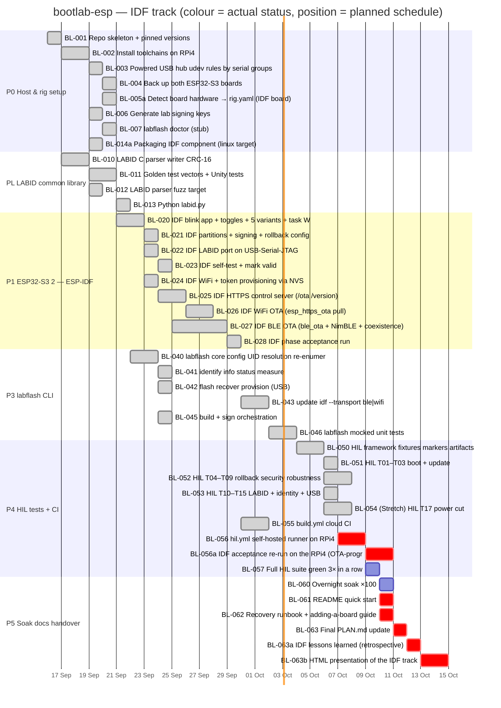
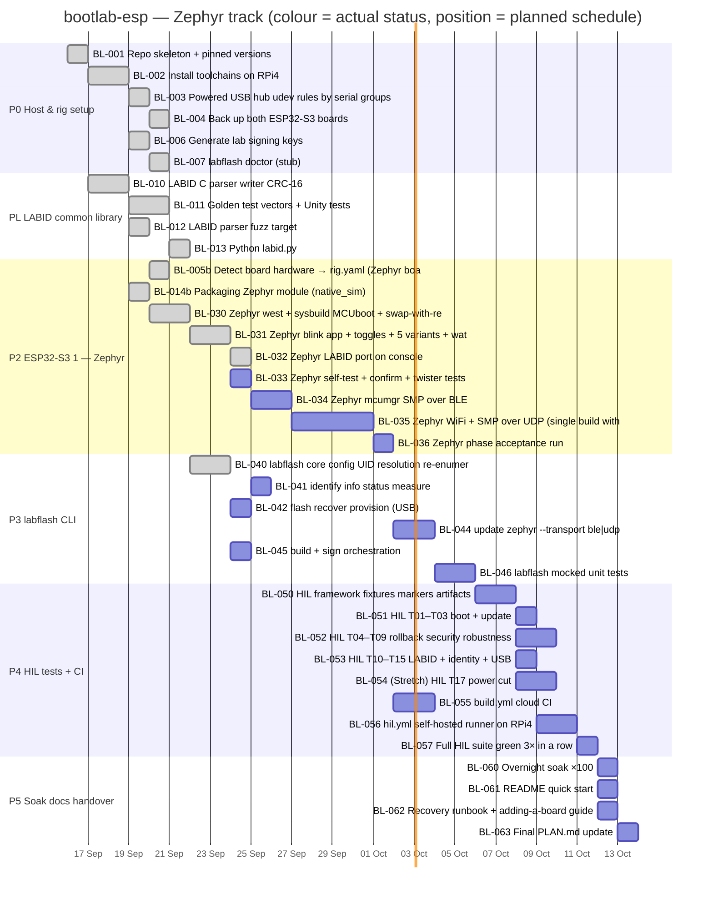

# Gantt — schedule, progress and dependencies (per board)

> Generated from `tickets.json` by `python3 tickets/tickets_tool.py gantt` (also refreshed by `set`).
> **Do not edit.** Bar **colours are the actual status**; bar **positions are a plan** computed from ticket
> size (S=1 d, M=2 d, L=4 d) and dependencies, starting 2026-09-16 — not a record of when work ran.
> A dependency applies to the **same board only**, so an IDF step never waits on a Zephyr one.

## Progress

- **IDF track:** `████████████████████████░░░░░░` **33/42 done**
- **Zephyr track:** `█████████████░░░░░░░░░░░░░░░░░` **16/37 done**

| Epic | Phase | IDF | Zephyr |
|---|---|---|---|
| E0 Host & rig setup | P0 | `██████████` 8/8 | `██████████` 6/6 |
| EL LABID common library | PL | `██████████` 4/4 | `██████████` 4/4 |
| E1 ESP32-S3 #2 — ESP-IDF | P1 | `██████████` 9/9 | — |
| E2 ESP32-S3 #1 — Zephyr | P2 | — | `██████░░░░` 5/9 |
| E3 labflash CLI | P3 | `██████████` 6/6 | `██░░░░░░░░` 1/6 |
| E4 HIL tests + CI | P4 | `███████░░░` 6/9 | `░░░░░░░░░░` 0/8 |
| E5 Soak, docs, handover | P5 | `░░░░░░░░░░` 0/6 | `░░░░░░░░░░` 0/4 |

## Gantt — IDF track

**Legend:** green = ✅ done · blue = 🔵 acceptance criteria pass, held only by a dependency · red = 🟥 blocked · plain = ⬜ todo · orange line = today.

### Root blockers — IDF track

| Ticket | Blocks | Why it is blocked |
|---|---|---|
| **BL-056** hil.yml self-hosted runner on RPi4 | 8 tickets | hil.yml and its safety checks exist, but 'HIL job runs on PR for the idf board' is not demonstrated: no self-hosted runner is registered. Needs the R… |

### Ready to start — IDF track (todo, every dependency of this board done)

- none

### Waiting-on — IDF track

| Ticket | Status | Waiting on (unfinished dependencies) |
|---|---|---|
| BL-056 hil.yml self-hosted runner on RPi4 | 🟥 blocked | — |
| BL-056a IDF acceptance re-run on the RPi4 (OTA-progr | 🟥 blocked | BL-056[idf] 🟥 |
| BL-057 Full HIL suite green 3× in a row | ⬜ todo | BL-056[idf] 🟥 |
| BL-060 Overnight soak ×100 | ⬜ todo | BL-057[idf] ⬜ |
| BL-061 README quick start | 🟥 blocked | BL-057[idf] ⬜ |
| BL-062 Recovery runbook + adding-a-board guide | 🟥 blocked | BL-057[idf] ⬜ |
| BL-063 Final PLAN.md update | 🟥 blocked | BL-060[idf] ⬜ |
| BL-063a IDF lessons learned (retrospective) | 🟥 blocked | BL-060[idf] ⬜, BL-061[idf] 🟥, BL-062[idf] 🟥, BL-063[idf] 🟥, BL-056a[idf] 🟥 |
| BL-063b HTML presentation of the IDF track | 🟥 blocked | BL-063a[idf] 🟥 |

## Gantt — Zephyr track

**Legend:** green = ✅ done · blue = 🔵 acceptance criteria pass, held only by a dependency · red = 🟥 blocked · plain = ⬜ todo · orange line = today.

### Root blockers — Zephyr track

None: nothing on this board is blocked.

### Ready to start — Zephyr track (todo, every dependency of this board done)

- **BL-033** [S] Zephyr self-test + confirm + twister tests
- **BL-041** [S] identify, info, status, measure
- **BL-042** [S] flash, recover, provision (USB)
- **BL-045** [S] build + sign orchestration

### Waiting-on — Zephyr track

| Ticket | Status | Waiting on (unfinished dependencies) |
|---|---|---|
| BL-033 Zephyr self-test + confirm + twister tests | ⬜ todo | — |
| BL-034 Zephyr mcumgr SMP over BLE | ⬜ todo | BL-033[zephyr] ⬜ |
| BL-035 Zephyr WiFi + SMP over UDP (single build with | ⬜ todo | BL-034[zephyr] ⬜ |
| BL-036 Zephyr phase acceptance run | ⬜ todo | BL-035[zephyr] ⬜ |
| BL-041 identify info status measure | ⬜ todo | — |
| BL-042 flash recover provision (USB) | ⬜ todo | — |
| BL-044 update zephyr --transport ble|udp | ⬜ todo | BL-036[zephyr] ⬜ |
| BL-045 build + sign orchestration | ⬜ todo | — |
| BL-046 labflash mocked unit tests | ⬜ todo | BL-041[zephyr] ⬜, BL-042[zephyr] ⬜, BL-044[zephyr] ⬜, BL-045[zephyr] ⬜ |
| BL-050 HIL framework fixtures markers artifacts | ⬜ todo | BL-046[zephyr] ⬜ |
| BL-051 HIL T01–T03 boot + update | ⬜ todo | BL-050[zephyr] ⬜ |
| BL-052 HIL T04–T09 rollback security robustness | ⬜ todo | BL-050[zephyr] ⬜ |
| BL-053 HIL T10–T15 LABID + identity + USB | ⬜ todo | BL-050[zephyr] ⬜ |
| BL-054 (Stretch) HIL T17 power cut | ⬜ todo | BL-050[zephyr] ⬜ |
| BL-055 build.yml cloud CI | ⬜ todo | BL-036[zephyr] ⬜ |
| BL-056 hil.yml self-hosted runner on RPi4 | ⬜ todo | BL-055[zephyr] ⬜, BL-051[zephyr] ⬜ |
| BL-057 Full HIL suite green 3× in a row | ⬜ todo | BL-051[zephyr] ⬜, BL-052[zephyr] ⬜, BL-053[zephyr] ⬜, BL-056[zephyr] ⬜ |
| BL-060 Overnight soak ×100 | ⬜ todo | BL-057[zephyr] ⬜ |
| BL-061 README quick start | ⬜ todo | BL-057[zephyr] ⬜ |
| BL-062 Recovery runbook + adding-a-board guide | ⬜ todo | BL-057[zephyr] ⬜ |
| BL-063 Final PLAN.md update | ⬜ todo | BL-060[zephyr] ⬜ |
