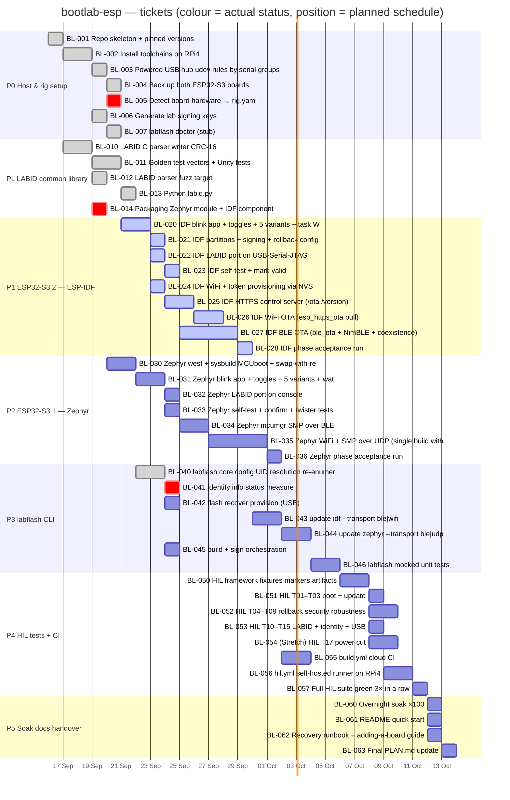

# Gantt — schedule, progress and dependencies

> Generated from `tickets.json` by `python3 tickets/tickets_tool.py gantt` (also refreshed by `set`).
> **Do not edit.** Bar **colours are the actual status**; bar **positions are a plan** computed from ticket
> size (S=1 d, M=2 d, L=4 d) and dependencies, starting 2026-09-16 — not a record of when work ran.

## Progress

`███████░░░░░░░░░░░░░░░░░░░░░░░` **11/47 done**

- ✅ done: **11**
- 🔵 acceptance criteria PASS, waiting only on a dependency: **9**
- 🟥 blocked, work outstanding: **3**
- ⬜ todo: **24**

| Epic | Phase | Progress | Done | State |
|---|---|---|---|---|
| E0 Host & rig setup | P0 | `██████████░░` | 6/7 | 🟥 blocked |
| EL LABID common library | PL | `██████████░░` | 4/5 | 🟥 blocked |
| E1 ESP32-S3 #2 — ESP-IDF | P1 | `░░░░░░░░░░░░` | 0/9 | 🟥 blocked |
| E2 ESP32-S3 #1 — Zephyr | P2 | `░░░░░░░░░░░░` | 0/7 | ⬜ todo |
| E3 labflash CLI | P3 | `██░░░░░░░░░░` | 1/7 | 🟥 blocked |
| E4 HIL tests + CI | P4 | `░░░░░░░░░░░░` | 0/8 | ⬜ todo |
| E5 Soak, docs, handover | P5 | `░░░░░░░░░░░░` | 0/4 | ⬜ todo |

## Gantt

**Legend:** grey/green = ✅ done · blue = 🔵 acceptance criteria pass, held only by a dependency · red = 🟥 blocked · plain = ⬜ todo · orange line = today.

## Root blockers — what actually gates the rest

Blocked tickets with **nothing unfinished beneath them**. Finishing (or explicitly re-scoping) these is what moves the blue tickets to done.

| Ticket | Blocks | Why it is blocked |
|---|---|---|
| **BL-005** Detect board hardware → rig.yaml | 33 tickets | PSRAM mode done (idf run-tested octal; zephyr inferred octal). Only the zephyr board's LED GPIO is left: needs a blink app flashed to that board (bac… |
| **BL-014** Packaging Zephyr module + IDF component | 29 tickets | BLOCKED: AC requires Zephyr native_sim + IDF linux builds; Zephyr path on hold + throttle != 0x0 |

## Ready to start (todo, every dependency done)

- **BL-030** [M] Zephyr west + sysbuild MCUboot + swap-with-revert check

## Waiting-on table

| Ticket | Status | Waiting on (unfinished dependencies) |
|---|---|---|
| BL-005 Detect board hardware → rig.yaml | 🟥 blocked | — |
| BL-014 Packaging Zephyr module + IDF component | 🟥 blocked | — |
| BL-020 IDF blink app + toggles + 5 variants + task WDT | 🟥 blocked | BL-005 🟥, BL-014 🟥 |
| BL-021 IDF partitions + signing + rollback config | 🟥 blocked | BL-020 🟥 |
| BL-022 IDF LABID port on USB-Serial-JTAG | 🟥 blocked | BL-020 🟥 |
| BL-023 IDF self-test + mark valid | 🟥 blocked | BL-021 🟥 |
| BL-024 IDF WiFi + token provisioning via NVS | 🟥 blocked | BL-020 🟥 |
| BL-025 IDF HTTPS control server (/ota /version) | 🟥 blocked | BL-024 🟥 |
| BL-026 IDF WiFi OTA (esp_https_ota pull) | 🟥 blocked | BL-025 🟥, BL-023 🟥 |
| BL-027 IDF BLE OTA (ble_ota + NimBLE + coexistence) | 🟥 blocked | BL-023 🟥 |
| BL-028 IDF phase acceptance run | 🟥 blocked | BL-022 🟥, BL-026 🟥, BL-027 🟥 |
| BL-030 Zephyr west + sysbuild MCUboot + swap-with-revert ch | ⬜ todo | — |
| BL-031 Zephyr blink app + toggles + 5 variants + watchdog | ⬜ todo | BL-030 ⬜, BL-005 🟥 |
| BL-032 Zephyr LABID port on console | ⬜ todo | BL-031 ⬜, BL-014 🟥 |
| BL-033 Zephyr self-test + confirm + twister tests | ⬜ todo | BL-031 ⬜ |
| BL-034 Zephyr mcumgr SMP over BLE | ⬜ todo | BL-033 ⬜ |
| BL-035 Zephyr WiFi + SMP over UDP (single build with BT) | ⬜ todo | BL-034 ⬜ |
| BL-036 Zephyr phase acceptance run | ⬜ todo | BL-032 ⬜, BL-035 ⬜ |
| BL-041 identify info status measure | 🟥 blocked | BL-020 🟥, BL-022 🟥 |
| BL-042 flash recover provision (USB) | ⬜ todo | BL-020 🟥, BL-021 🟥 |
| BL-043 update idf --transport ble|wifi | ⬜ todo | BL-028 🟥 |
| BL-044 update zephyr --transport ble|udp | ⬜ todo | BL-036 ⬜ |
| BL-045 build + sign orchestration | ⬜ todo | BL-020 🟥, BL-021 🟥, BL-030 ⬜, BL-031 ⬜ |
| BL-046 labflash mocked unit tests | ⬜ todo | BL-041 🟥, BL-042 ⬜, BL-043 ⬜, BL-044 ⬜, BL-045 ⬜ |
| BL-050 HIL framework fixtures markers artifacts | ⬜ todo | BL-046 ⬜ |
| BL-051 HIL T01–T03 boot + update | ⬜ todo | BL-050 ⬜ |
| BL-052 HIL T04–T09 rollback security robustness | ⬜ todo | BL-050 ⬜ |
| BL-053 HIL T10–T15 LABID + identity + USB | ⬜ todo | BL-050 ⬜ |
| BL-054 (Stretch) HIL T17 power cut | ⬜ todo | BL-050 ⬜ |
| BL-055 build.yml cloud CI | ⬜ todo | BL-028 🟥, BL-036 ⬜ |
| BL-056 hil.yml self-hosted runner on RPi4 | ⬜ todo | BL-055 ⬜, BL-051 ⬜ |
| BL-057 Full HIL suite green 3× in a row | ⬜ todo | BL-051 ⬜, BL-052 ⬜, BL-053 ⬜, BL-056 ⬜ |
| BL-060 Overnight soak ×100 | ⬜ todo | BL-057 ⬜ |
| BL-061 README quick start | ⬜ todo | BL-057 ⬜ |
| BL-062 Recovery runbook + adding-a-board guide | ⬜ todo | BL-057 ⬜ |
| BL-063 Final PLAN.md update | ⬜ todo | BL-060 ⬜ |
