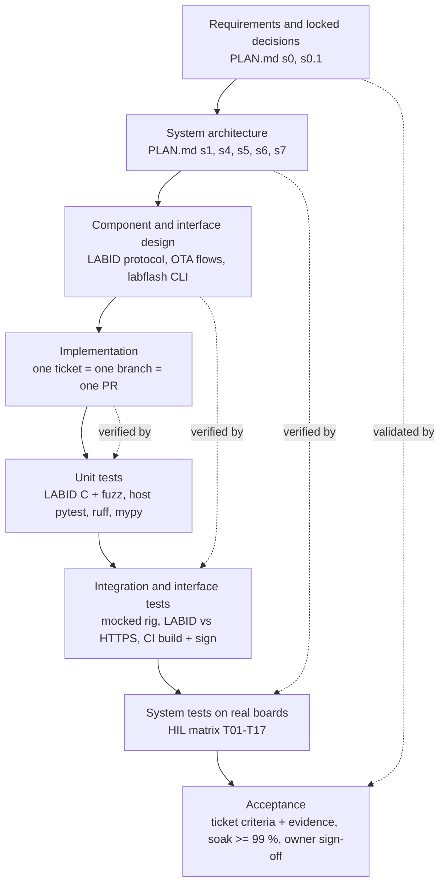

# Software lifecycle and V-model followed in this project

> How bootlab-esp was planned, built, verified and accepted. Every statement points at a real artifact in this repo.
> Live progress is in [TICKETS.md](TICKETS.md) and [GANTT.md](GANTT.md); this page explains the *process* behind them.
> Last reviewed: 2026-09-24.

## 1. In one paragraph

The project follows a **plan-driven V-model** (requirements and architecture on the left, matching verification on the
right) delivered in **ticket-sized iterations**, with **explicit replans** and an **independent review** that feeds a
lessons-learned loop. Work is done by an owner and AI coding agents working together under written guardrails
(`PLAN.md` section 10). The rule that ties it together: *a claim only counts if there is evidence that could have failed.*

## 2. The V-model, mapped to this repository

| V level | What defines it (left side) | What verifies it (right side) |
|---|---|---|
| Requirements | `PLAN.md` goal, locked decisions, non-goals (s0). Ticket acceptance criteria in `tickets.json` | **Acceptance:** each ticket's criteria met with evidence in `scripts/evidence/`; owner review and sign-off (`docs/LESSONS_LEARNED.md` s7); soak pass rate >= 99 % (BL-060) |
| System architecture | Board architecture, flash layouts (s4), boot / update / rollback flows (s5), security and keys (s6), protocols (s7) | **System tests (HIL):** matrix T01-T17 in `PLAN.md` s8 P4 (boot, update both ways, `no_confirm`, `hang`, `bad_sig`, truncated image, interrupted transfer, wrong token, identity, LABID robustness, soak), run on the real boards (`tests_hil/`) |
| Component and interface design | LABID serial protocol (s7.3), IDF OTA over WiFi and BLE, `labflash` CLI, rig configuration (`host/config/rig.yaml`) | **Integration:** host tests with a mocked rig, the LABID-vs-HTTPS cross-check on every update, CI build and sign of both firmware families |
| Implementation | One ticket = one branch = one PR, with acceptance criteria copied in | **Unit:** LABID C unit and fuzz tests (`common/labid/tests`), Python unit tests (`host/tests`, `tickets/tests`), `ruff`, `mypy`, forbidden-config grep |

The bottom of the V is the code. The test pyramid in `PLAN.md` s8 P4 (unit, integration or simulation, HIL) is the
right-hand side of this V.

## 3. Lifecycle phases actually followed

Phases come from `PLAN.md` s8 (P0-P5). Ticket epics E0-E5 match them.

| Phase | What it delivered | How it was verified |
|---|---|---|
| P0 Host and rig setup | Toolchains, two identical boards told apart by USB serial, backups | Board identity checked before every flash (guardrail) |
| PL LABID library | Common serial identity protocol (`$LAB,...*CRC`), shared by both firmwares | C unit tests, fuzz smoke, test vectors |
| P1 ESP-IDF board | Partitions, dual slot, rollback, signed OTA over WiFi (HTTPS pull) and BLE | HIL tests T01-T09 on the board; `bad_sig`, `hang`, `no_confirm` variants |
| P2 Zephyr board | MCUboot swap-with-revert, SMP over BLE and UDP | Risk R1 is the first gate of P2 by plan (does MCUboot support swap-with-revert on ESP32-S3); swap and confirm behaviour then checked on the board (see `docs/LESSONS_LEARNED.md` Trap 14) |
| P3 `labflash` CLI | `identify`, `flash`, `update`, `provision`, `doctor` | Mocked-rig unit tests plus live runs; independent LABID check after each update |
| P4 HIL tests and CI | Test matrix T01-T17, GitHub Actions build and sign, self-hosted HIL runner | Green CI on `master`; runner isolation check (no sudo, no keys) |
| P5 Soak, docs, handover | 100-cycle live soak, README, recovery and adding-a-board guides, presentation | Soak evidence, lessons learned, owner sign-off |

**Replan, 2026-09-21** (`PLAN.md` s8.0): finish the IDF board completely first (P1, P3-P5 for IDF), then a
lessons-learned retrospective (BL-063a) and a presentation (BL-063b), and only then the Zephyr board. Tickets that cover both
boards carry per-board `tracks` with their own status and acceptance criteria. This is the "iteration" part of the
process: the V is re-entered per board.

## 4. How one ticket moves (the daily loop)

`tickets.json` is the single source of truth. `tickets_tool.py` validates it and generates `TICKETS.md`, `GANTT.md` and
`tickets.csv`. **Never edit the generated files by hand.**

1. **Pick** a ticket from "Ready to start now" (all its dependencies done) - `tickets_tool.py next`.
2. **Start:** `set BL-xxx doing`.
3. **Test first (TDD):** write a failing test (RED), the minimal change (GREEN), then refactor. Target 80 %+ coverage
   (CI gate `--cov-fail-under=80`).
4. **Review:** code review after writing code, security review for anything touching input, keys, files or the network.
5. **One branch, one PR:** the PR copies the acceptance criteria, each with evidence.
6. **Evidence file:** commands and real output go in `scripts/evidence/blNNN_*.md`. Hardware results must come from the
   hardware; a simulator run is labelled as one.
7. **Close:** `set BL-xxx review --pr <url>`, then `done` after merge. Blocked work is `blocked` with a reason; work
   that is no longer wanted is `canceled` with a reason and a replacement (see s6).

Statuses: `todo`, `doing`, `review`, `blocked`, `done`, `canceled`. `canceled` tickets are out of scope: not counted in
progress, not scheduled, and they do not gate other tickets, but they stay visible in their own section.

## 5. Verification and validation on real hardware

- **Two independent channels for every update.** After each OTA the soak checks the running version, the slot flip, the
  confirm flag and the board identity through LABID (serial) *and* the HTTPS `/version` endpoint. The version string is baked
  into the running binary, so a tool cannot fake it.
- **Failure paths are tested on purpose,** not just the happy path: images that never confirm, hang, or carry a bad
  signature must be rejected or rolled back (T04-T07).
- **Soak:** alternating v1 and v2 over WiFi and BLE, verified every cycle, results appended to `cycles.jsonl` as they
  happen (`tests_hil/soak.py`; runbook `docs/BL060_SOAK_TEST.md`).
- **CI (GitHub Actions):** forbidden-config grep, LABID unit and fuzz, Python host tests (lint, types, coverage), ESP-IDF
  build and sign, Zephyr build and sign; plus a self-hosted `hil.yml` runner for hardware tests.

## 6. Risk management, guardrails, change control

- **Risk register:** `PLAN.md` s9, R1-R15 (for example R1 no swap-with-revert in MCUboot, R4 accidental eFuse burn, R7 USB
  power, R14 the WSL2 / usbipd reset-on-open). Each has a mitigation, and several were later found to be real.
- **Guardrails** (`PLAN.md` s10). Never burn eFuses or enable secure boot, flash encryption or anti-rollback; never commit
  keys; never flash a board without confirming its identity; stop and ask the owner when a risk triggers.
- **Change control:** decisions are recorded in the plan (s8.0 replan, s11 owner items) and in the tickets. Example,
  2026-09-24: work that depended on the Raspberry Pi 4 (BL-056a, BL-068) was `canceled` with the reason (live
  under-voltage during an OTA) and replaced by machine-based tickets (BL-071, BL-072). BL-056, the CI runner, was
  reinstated as a secondary CI/CD demo after the owner asked for it.

## 7. Feedback loops: review, lessons learned, retrospective

- **Independent review** (`scripts/evidence/REVIEW_2026-09-21.md`): a reviewer re-ran the claims and found that a "100 %
  soak pass" and a "3 green runs" result had come from a simulated rig. The tickets were reverted, the plan boxes
  unchecked, and the rule became: *a simulator result is never presented as hardware evidence.*
- **Lessons learned** (`docs/LESSONS_LEARNED.md`): 23 traps to date (for example the WSL2 serial reset, a shared sdkconfig
  building the wrong variant, a false "success" from MCUboot bookkeeping, Python 3.13 rejecting the lab CA, an
  under-voltage Pi stalling an OTA), each with symptom, cause and resolution.
- **Retrospective:** BL-063a, and the owner sign-off recorded in the lessons document.

## 8. Where AI agents fit

AI coding agents do much of the implementation, test writing, review and documentation, under these constraints: the
owner sets scope and makes the decisions (locked decisions and replans are in the plan); agents work from tickets with
acceptance criteria; every hardware claim needs evidence; agents must stop and ask at the escalation points; and a
separate review pass re-checks claims. The independent review in s7 is the proof that this loop catches mistakes.

## 9. Known gaps in the process (honest list)

- On the first pass, part of the right-hand side of the V was recorded on a mock rig before the live rig path existed
  (corrected by the 2026-09-21 review, tickets BL-057 and BL-060).
- Hardware secure boot, flash encryption and anti-rollback are deliberately off on the lab boards (guardrail R4); update
  signatures are verified at update time only.
- Open work is visible in [TICKETS.md](TICKETS.md): the heavy randomized soak (BL-067), the image generator (BL-069), the
  two-boards run (BL-072), and two known Zephyr issues (BL-064, BL-065).
