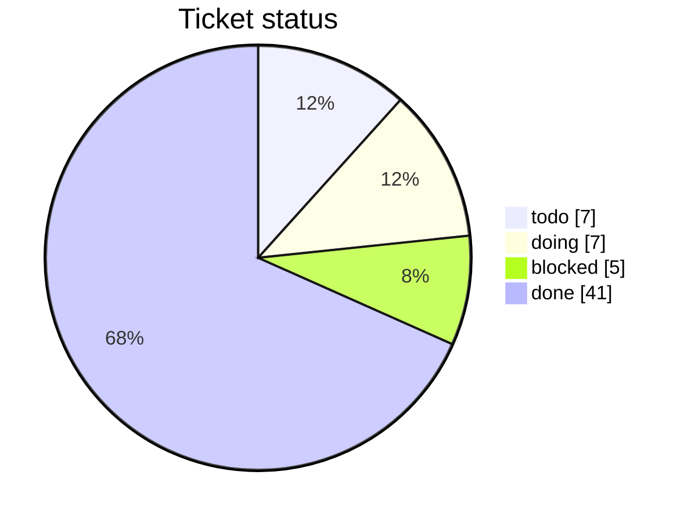
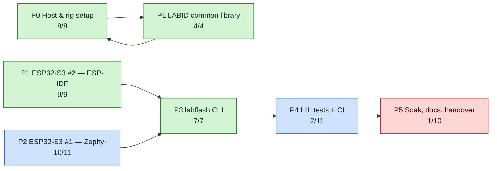
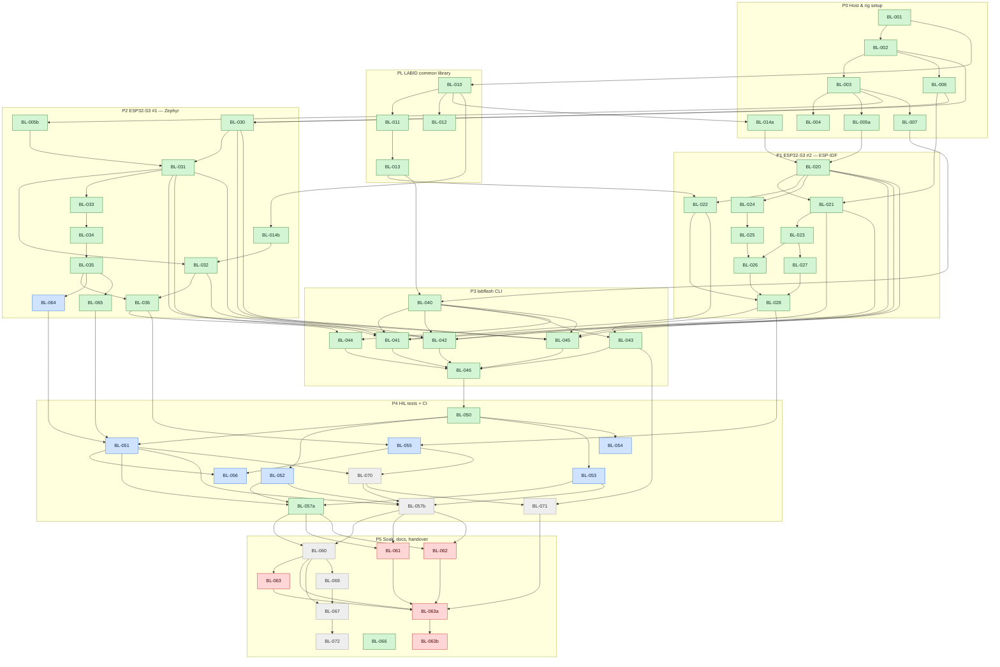

# bootlab-esp — Tickets & Progress

> Generated from `tickets.json` by `tickets_tool.py render`. **Do not edit by hand.**
> Plan reference: `PLAN.md`. Legend: ⬜ todo · 🔵 doing · 🟣 review · 🟥 blocked · ✅ done · 🚫 canceled (out of scope, not counted)
> **Schedule, progress and what blocks what: see [GANTT.md](GANTT.md).**

## Overall

`████████████████████░░░░░░░░░░` **41/60 done (68%)**

- **IDF track:** `███████████████░░░░░` 35/47
- **Zephyr track:** `██████████████░░░░░░` 28/41

## Epics

| Epic | Phase | Title | Progress | Done | Status | Plan |
|---|---|---|---|---|---|---|
| E0 | P0 | Host & rig setup | `████████████` | 8/8 | ✅ done | §2, §3, §8 P0 |
| EL | PL | LABID common library | `████████████` | 4/4 | ✅ done | §7.3, §8 PL |
| E1 | P1 | ESP32-S3 #2 — ESP-IDF | `████████████` | 9/9 | ✅ done | §4.2, §5, §6, §7.2, §8 P1 |
| E2 | P2 | ESP32-S3 #1 — Zephyr | `███████████░` | 10/11 | 🔵 doing | §4.1, §5, §6, §7.1, §8 P2 |
| E3 | P3 | labflash CLI | `████████████` | 7/7 | ✅ done | §8 P3 |
| E4 | P4 | HIL tests + CI | `██░░░░░░░░░░` | 2/11 | 🔵 doing | §8 P4 |
| E5 | P5 | Soak, docs, handover | `█░░░░░░░░░░░` | 1/10 | 🟥 blocked | §8 P5 |

## Epic dependency graph

## Ready to start now

- Nothing ready (check blocked tickets).

## Blocked

- 🟥 **BL-061** README quick start 
- 🟥 **BL-062** Recovery runbook + adding-a-board guide 
- 🟥 **BL-063** Final PLAN.md update 
- 🟥 **BL-063a** IDF lessons learned (retrospective) 
- 🟥 **BL-063b** HTML presentation of the IDF track 

## Canceled (out of scope: not counted, not scheduled, do not gate anything)

| | ID | Title | Why | Replaced by |
|---|---|---|---|---|
| 🚫 | BL-056a | [CANCELED: RPi4] IDF acceptance re-run on the RPi4 (OTA-programming host) | RPi4 cannot be depended on (owner decision 2026-09-24): live under-voltage while serving an OTA (vcgencmd get_throttled 0x50005, download stalled at 196,608 of 1,249,280 bytes), documented power instability (docs/rpi4_limitations.md 2.1), Bluetooth had to be unmasked by hand, no board attached by default. See docs/LESSONS_LEARNED.md Traps 20-23. This work moves to the development machine (workstation: Windows-native tools + WSL). | BL-071 |
| 🚫 | BL-068 | [CANCELED: RPi4] [Advanced] Multi-board randomized OTA soak: two boards in random parallel (400 cycles) | RPi4 cannot be depended on (owner decision 2026-09-24): live under-voltage while serving an OTA (vcgencmd get_throttled 0x50005, download stalled at 196,608 of 1,249,280 bytes), documented power instability (docs/rpi4_limitations.md 2.1), Bluetooth had to be unmasked by hand, no board attached by default. See docs/LESSONS_LEARNED.md Traps 20-23. This work moves to the development machine (workstation: Windows-native tools + WSL). | BL-072 |

## Tickets by epic

### E0 · P0 — Host & rig setup

| | ID | Title | Size | Boards | Depends on | PR |
|---|---|---|---|---|---|---|
| ✅ | BL-001 | Repo skeleton + pinned versions | S | host | — |  |
| ✅ | BL-002 | Install toolchains on RPi4 | M | host | BL-001 |  |
| ✅ | BL-003 | Powered USB hub, udev rules by serial, groups | S | host | BL-002 |  |
| ✅ | BL-004 | Back up both ESP32-S3 boards | S | zephyr, idf | BL-003 |  |
| ✅ | BL-005a | Detect board hardware → rig.yaml (IDF board) | S | idf | BL-003 |  |
| ✅ | BL-006 | Generate lab signing keys | S | host | BL-002 |  |
| ✅ | BL-007 | labflash doctor (stub) | S | host | BL-003 |  |
| ✅ | BL-014a | Packaging: IDF component (linux target) | S | common | BL-010 |  |

✅ <b>BL-001</b> — Repo skeleton + pinned versions

- **Size:** S (≤ 0.5 day)  
- **Boards:** host  
- **Depends on:** —  
- **Plan:** §2, §3, §8 P0

Create the tree from PLAN §3. Pin Zephyr, IDF, MCUboot, ble_ota versions in scripts/versions.env.

**Acceptance criteria**
- [x] Tree matches PLAN §3
- [x] keys/, backups/, *.pem ignored by git
- [x] versions.env lists every pinned dependency

✅ <b>BL-002</b> — Install toolchains on RPi4

- **Size:** M (1–2 days)  
- **Boards:** host  
- **Depends on:** BL-001  
- **Plan:** §2, §3, §8 P0

Python 3.11+, BlueZ, west + Zephyr SDK, ESP-IDF, imgtool, esptool. Note: these ACs verify toolchain presence/version only, not that a build succeeds. Actual Zephyr build capability is a separate open question, tracked under the Zephyr esptool re-test (build gate).

**Acceptance criteria**
- [x] scripts/check_env.sh prints all versions and exits 0
- [x] Versions match versions.env

✅ <b>BL-003</b> — Powered USB hub, udev rules by serial, groups

- **Size:** S (≤ 0.5 day)  
- **Boards:** host  
- **Depends on:** BL-002  
- **Plan:** §2, §3, §8 P0

Powered USB hub, udev rules by serial, groups. [BLOCKED 2026-09-17 on RPi4: AC3 (no brown-out resets over 10min) FAILS — continuous under-voltage, get_throttled=0x50000 on every read, 92 events this boot. Rate INDEPENDENT of attached peripherals: 2 boards ~2.0/min, 1 board ~2.0-2.5/min, 0 boards ~1.0/min => PSU/rail fault, NOT board load. This RPi4 finding stands as a separate, unresolved hardware-specific issue; see scripts/evidence/bl003_ac3_observation.jsonl. [DONE 2026-09-20 on WSL2 host, after RPi4->WSL2 migration: AC1 PASS (/dev/lab-esp-zephyr and /dev/lab-esp-idf exist, correctly mapped). AC2 PASS, verified across a real physical USB port swap on the Windows host, cross-checked via esptool chip-id and udevadm ID_SERIAL_SHORT — symlinks follow MAC/serial, not port order. AC3 PASS, 10-min clean observation 2026-09-20T03:11:57-03:21:57, 41 samples/15s, zero drops; the earlier WSL2-specific AC3 failure (usbipd/USB-IP bridge dropping both boards simultaneously ~1m45s in, confirmed via dmesg vhci_hcd disconnect logs) was a Windows USB selective-suspend issue under HP's custom power plan, fixed via powercfg at the registry level. Full evidence: scripts/evidence/bl003_ac3_wsl2_observation.md. This WSL2 pass does not overwrite or contradict the RPi4's separate PSU/rail finding above.]

**Acceptance criteria**
- [x] /dev/lab-esp-zephyr and /dev/lab-esp-idf exist
- [x] Symlinks survive replug and port swap
- [x] No brown-out resets over 10 min

✅ <b>BL-004</b> — Back up both ESP32-S3 boards

- **Size:** S (≤ 0.5 day)  
- **Boards:** zephyr, idf  
- **Depends on:** BL-003  
- **Plan:** §2, §3, §8 P0

esptool read_flash of the current firmware before any erase.

**Acceptance criteria**
- [x] 2 backup images in backups/
- [x] docs/recovery.md has the restore command
- [x] Nothing committed to git

✅ <b>BL-005a</b> — Detect board hardware → rig.yaml (IDF board)

- **Size:** S (≤ 0.5 day)  
- **Boards:** idf  
- **Tracks:** IDF ✅ done  
- **Depends on:** BL-003  
- **Plan:** §2, §3, §8 P0

Split from BL-005 on 2026-09-21 (replan: IDF first). DONE with evidence in scripts/evidence/bl005_hardware_detection.md: idf led_gpio=48 confirmed by a real blink (BL-020, PLAN R14); flash 16 MB quad; PSRAM 8 MB OCTAL run-tested (octal_psram driver, 'Found 8MB PSRAM device', memory test OK); host/config/rig.yaml idf entry filled. HISTORY (original BL-005): Flash size, PSRAM, board revision, RGB LED GPIO (48 or 38), USB serial per board. [PARTIAL 2026-09-20: idf board's led_gpio confirmed 48 via a real physical power-cycle test during BL-020 (see PLAN Sec 9 R14) -- rig.yaml updated. This is only half the AC: zephyr's led_gpio remains unknown (Zephyr path on hold), and psram_mode (quad/octal) is still unverified for BOTH boards. Staying blocked.] [PROGRESS 2026-09-21 -- ONE ITEM LEFT: the zephyr board's LED GPIO. DONE: (1) PSRAM mode. Both boards' pre-project eFuse dumps are identical in every PSRAM field (8M, vendor AP_3v3; 'AP_3v3' is the 3.3 V variant, not 'quad'; on the ESP32-S3 8 MB embedded PSRAM is the Octal part). idf board: CONFIRMED octal by booting an Octal-PSRAM detection build (esp_idf/sdkconfig.psram, not a product image): octal_psram vendor AP / 64 Mbit / 3V, 'Found 8MB PSRAM device', 'SPI SRAM memory test OK', 8192K added to the heap; board restored to v1. zephyr board: octal INFERRED from identical eFuses, not run-tested. host/config/rig.yaml now says octal for both, with the confidence in the comments. (2) idf led_gpio=48 (BL-020). Evidence: scripts/evidence/bl005_hardware_detection.md. REMAINING: zephyr led_gpio -- needs a blink app on that board, i.e. writing its flash (backup: backups/esp_ACA7042C3B04.bin + .sha256; identity AC:A7:04:2C:3B:04). Needs the owner's per-instance go-ahead; an IDF blink build would do it without touching the Zephyr toolchain, and the backup is restored afterwards.]

**Acceptance criteria**
- [x] host/config/rig.yaml filled for the idf board
- [x] LED GPIO confirmed by a quick blink (idf board)

✅ <b>BL-006</b> — Generate lab signing keys

- **Size:** S (≤ 0.5 day)  
- **Boards:** host  
- **Depends on:** BL-002  
- **Plan:** §2, §3, §8 P0

scripts/gen_keys.sh: zephyr_p256, idf_sbv2. Refuses to overwrite.

**Acceptance criteria**
- [x] 2 keys in keys/
- [x] Second run refuses to overwrite
- [x] git status shows no key files

✅ <b>BL-007</b> — labflash doctor (stub)

- **Size:** S (≤ 0.5 day)  
- **Boards:** host  
- **Depends on:** BL-003  
- **Plan:** §2, §3, §8 P0

Minimal environment check. [EVIDENCE 2026-09-17 on RPi4: doctor verified OK while both boards were attached — output: 'ESP USB devices : 2/2  OK / Bluetooth : OK / WiFi : OK / Result: ALL OK', exit 0. Non-zero-exit path previously proven (exit 1 with 0 boards). At the time, dep-gated behind BL-003 (blocked on AC3/PSU). [DONE 2026-09-20 on WSL2 host, after BL-003 closed: rewrote doctor.py's ESP check to use pyserial (VID 0x303A) instead of shelling out to lsusb, since lsusb was not installed on this host — no longer depends on it either way. Added host-aware N/A logic for BT/WiFi: on a host with no BT stack (no hciconfig/bluetoothctl) or no wireless stack (no nmcli and no wlan* iface) reachable at all, those checks report N/A and do not count against the exit code, since WSL2 has no native BT/WiFi passthrough configured (a genuine host-capability gap, not a missing dependency). ESP USB board check remains a hard requirement everywhere. Fresh run with both boards attached: 'ESP USB devices : 2/2  OK / Bluetooth : N/A (not testable on this host) / WiFi : N/A (not testable on this host) / Result: ALL OK', exit 0.]

**Acceptance criteria**
- [x] Reports 2 ESP USB devices, BT adapter, WiFi
- [x] Non-zero exit on any missing item

✅ <b>BL-014a</b> — Packaging: IDF component (linux target)

- **Size:** S (≤ 0.5 day)  
- **Boards:** common  
- **Tracks:** IDF ✅ done  
- **Depends on:** BL-010  
- **Plan:** §2, §3, §8 P0

Split from BL-014 on 2026-09-21. DONE: scripts/idf_linux_test.sh builds the packaged labid component (labid.c + labid_dispatch.c) for the ESP-IDF linux target and runs the smoke test (0 warnings, exit 0). HISTORY (original BL-014): One source, two build integrations. [BLOCKED: AC requires Zephyr native_sim + IDF linux builds; Zephyr path on hold + throttle != 0x0] [PROGRESS 2026-09-21 -- IDF HALF VERIFIED, Zephyr half NOT. 'Builds for ... IDF linux target': PASS. scripts/idf_linux_test.sh builds the packaged labid component (labid.c + labid_dispatch.c) for the ESP-IDF linux (host) target and RUNS a smoke test (esp_idf/test/main/main.c: CRC check vector, writer, and the dispatcher answering HELLO / ID? / an unknown request with ERR, via a fake provider): build exit 0, 0 warnings, process exit status 0, 'linux-target smoke: all checks passed'; verified again from a clean environment. Found while doing it: the old smoke test defined main() and could never have linked on the IDF linux target (the FreeRTOS simulator calls app_main()); it now uses app_main() + exit(status). It also did not cover labid_dispatch.c, so the package would not have noticed that file missing; it does now. Prerequisite: IDF's linux target needs libbsd-dev; the script uses the system package when present and otherwise unpacks the matching .deb into .cache/ (gitignored), so it works where sudo needs a password. NOT VERIFIED: 'Zephyr native_sim' (Zephyr hold), and the Zephyr branch of common/labid/CMakeLists.txt that I edited to add labid_dispatch.c (BL-022) has never been built. Ticket stays blocked on the native_sim half; an owner decision is needed to split or re-scope it (see tickets/GANTT.md root blockers).]

**Acceptance criteria**
- [x] Builds for the IDF linux target

### EL · PL — LABID common library

| | ID | Title | Size | Boards | Depends on | PR |
|---|---|---|---|---|---|---|
| ✅ | BL-010 | LABID C parser, writer, CRC-16 | M | common | BL-001 |  |
| ✅ | BL-011 | Golden test vectors + Unity tests | M | common | BL-010 |  |
| ✅ | BL-012 | LABID parser fuzz target | S | common | BL-010 |  |
| ✅ | BL-013 | Python labid.py | S | host | BL-011 |  |

✅ <b>BL-010</b> — LABID C parser, writer, CRC-16

- **Size:** M (1–2 days)  
- **Boards:** common  
- **Depends on:** BL-001  
- **Plan:** §7.3, §8 PL

C99, no malloc, no RTOS calls, fixed buffers, provider callbacks.

**Acceptance criteria**
- [x] Implements PLAN §7.3
- [x] CRC('123456789') == 0x29B1
- [x] -Wall -Wextra -Werror clean

✅ <b>BL-011</b> — Golden test vectors + Unity tests

- **Size:** M (1–2 days)  
- **Boards:** common  
- **Depends on:** BL-010  
- **Plan:** §7.3, §8 PL

test_vectors.json: valid frames, bad CRC, too long, unknown keys, garbage.

**Acceptance criteria**
- [x] 100 % vectors pass
- [x] Coverage ≥ 90 % line + branch

✅ <b>BL-012</b> — LABID parser fuzz target

- **Size:** S (≤ 0.5 day)  
- **Boards:** common  
- **Depends on:** BL-010  
- **Plan:** §7.3, §8 PL

libFuzzer + ASan/UBSan.

**Acceptance criteria**
- [x] 10 min fuzz, 0 crashes, 0 sanitizer errors

✅ <b>BL-013</b> — Python labid.py

- **Size:** S (≤ 0.5 day)  
- **Boards:** host  
- **Depends on:** BL-011  
- **Plan:** §7.3, §8 PL

Same framing + CRC in host/labflash/labid.py.

**Acceptance criteria**
- [x] Passes the same test_vectors.json
- [x] mypy clean

### E1 · P1 — ESP32-S3 #2 — ESP-IDF

| | ID | Title | Size | Boards | Depends on | PR |
|---|---|---|---|---|---|---|
| ✅ | BL-020 | IDF blink app + toggles + 5 variants + task WDT | M | idf | BL-005a, BL-014a |  |
| ✅ | BL-021 | IDF partitions + signing + rollback config | S | idf | BL-020, BL-006 |  |
| ✅ | BL-022 | IDF LABID port on USB-Serial-JTAG | S | idf | BL-020, BL-013 |  |
| ✅ | BL-023 | IDF self-test + mark valid | S | idf | BL-021 |  |
| ✅ | BL-024 | IDF WiFi + token provisioning via NVS | S | idf | BL-020 |  |
| ✅ | BL-025 | IDF HTTPS control server (/ota, /version) | M | idf | BL-024 |  |
| ✅ | BL-026 | IDF WiFi OTA (esp_https_ota pull) | M | idf | BL-025, BL-023 |  |
| ✅ | BL-027 | IDF BLE OTA (ble_ota + NimBLE + coexistence) | L | idf | BL-023 |  |
| ✅ | BL-028 | IDF phase acceptance run | S | idf | BL-022, BL-026, BL-027 |  |

✅ <b>BL-020</b> — IDF blink app + toggles + 5 variants + task WDT

- **Size:** M (1–2 days)  
- **Boards:** idf  
- **Tracks:** IDF ✅ done  
- **Depends on:** BL-005a, BL-014a  
- **Plan:** §4.2, §5, §6, §7.2, §8 P1

FreeRTOS blink task (led_strip), toggles counter, variants per PLAN §5.3, CONFIG_ESP_TASK_WDT_PANIC. [PROGRESS 2026-09-20: ESP-IDF v6.0.3 installed on this host (git clone --recursive --branch v6.0.3, install.sh esp32s3), idf.py --version confirms 'ESP-IDF v6.0.3' exact. All 5 variants built for real against the esp32s3 target: v1 (default build/), v2, no_confirm, hang, bad_sig each in their own -B build dir with a per-variant sdkconfig fragment, all exit 0. Verified each build actually compiled with the INTENDED variant selected (not silently defaulting to v1) by reading each build dir's generated config/sdkconfig.h: build/=CONFIG_APP_VARIANT_V1, build_v2/=CONFIG_APP_VARIANT_V2, build_no_confirm/=CONFIG_APP_VARIANT_NO_CONFIRM, build_hang/=CONFIG_APP_VARIANT_HANG, build_bad_sig/=CONFIG_APP_VARIANT_BAD_SIG. Real bug found and fixed along the way: (1) REQUIRES esp_task_wdt in main/CMakeLists.txt failed cmake configure -- that component was merged into esp_system in IDF v6, header now lives at esp_system/include/esp_task_wdt.h, fixed to REQUIRES esp_system. (2) app_main.c passed the Kconfig macro CONFIG_APP_VARIANT_V2 directly as a runtime function argument -- compile error 'undeclared', because IDF Kconfig choice macros for UNSELECTED options are not defined as 0, they simply don't exist as a symbol; fixed by wrapping in #if CONFIG_APP_VARIANT_V2/#else at compile time instead. .gitignore extended for esp_idf/build*/, managed_components/, sdkconfig.old (the per-variant build dirs weren't covered by the existing literal 'build/' pattern). 'All 5 variants build' AC is now genuinely met with real evidence. Still blocked -- 'v1 blinks 1 Hz', 'hang variant resets within 10s', and the R13 USB-serial-as-MAC AC all require an authorized real flash, which has not happened.] [EVIDENCE 2026-09-20, full honest chain: GPIO48 (Kconfig default) tried first -> LED showed steady, non-blinking light -> GPIO38 tried based on that signal (also steady) -> console-routing fix attempted (CONFIG_ESP_CONSOLE_USB_SERIAL_JTAG=y) -> still zero serial output across every capture method (idf.py monitor with/without --no-reset, raw cat, pyserial with dtr/rts forced False) -> discovered the board resets into ROM bootloader on ANY port open, confirmed via esptool --before no-reset repeatedly reporting 'Stub flasher is already running' / 'Staying in bootloader' -> DTR/RTS suppression tested and ruled out as a fix -> a TRUE PHYSICAL power-cycle (unplug/replug on the Windows host, bypassing usbipd/DTR-RTS entirely) produced a stable running state: lab-esp-idf blinked white at 1Hz on GPIO48, visually counted and confirmed by the owner. This proves GPIO48 was correct all along and the blink logic was never buggy -- every 'steady light' observation before this was R14's reset-into-bootloader behavior, not a code or pin defect. Full root-cause and impact recorded as PLAN Sec 9 R14 (this also revealed R14 as a likely HARD BLOCKER for BL-022, which needs sustained bidirectional serial). 'v1 blinks 1 Hz' AC: PASS. R13 AC: PASS, unaffected by any of this (confirmed via USB descriptor enumeration, not app-level serial). 'hang variant resets within 10s' AC: still open, and its testability itself is now in question -- a watchdog-triggered reset and an R14 bootloader-reset may be visually indistinguishable without reliable serial confirmation of the actual reset cause. Kconfig.projbuild's default is 48 (unchanged from before this cycle, comment updated to reflect confirmed status); rig.yaml's idf.led_gpio updated from 'unknown' to 48; BL-005 updated to reflect partial resolution (idf side only, stays blocked on zephyr + PSRAM).] [UPDATE 2026-09-21: R14 root cause narrowed -- the reset-on-open is caused by the usbipd/WSL2 bridge, not the chip. With the idf board detached from usbipd and opened natively on Windows (COM14, miniterm --dtr 0 --rts 0), blink_diag logs streamed and the 1 Hz blink continued, on both a long-running board and a freshly power-cycled one (uptime restarted). So the 'hang variant resets within 10s' AC is testable via native Windows serial: the task-WDT panic and reboot show in the log. Hang variant rebuilt (build_hang, CONFIG_APP_VARIANT_HANG=1, GPIO48); flash + observation pending.] [EVIDENCE 2026-09-21: 'hang variant resets within 10 s' AC: PASS. build_hang (CONFIG_APP_VARIANT_HANG=1, GPIO48) flashed to lab-esp-idf (USB serial E0:72:A1:AA:23:90, identity verified before flash, hash verified). Observed natively on Windows (COM14, miniterm --dtr 0 --rts 0): app_main() at ~90 ms, 'task_wdt: Task watchdog got triggered ... blink (CPU 0/1)' at 5090 ms, then 'Rebooting...' with rst:0xc (RTC_SW_CPU_RST), Saved PC 0x4200b7f5 = task_wdt_timeout_handling (task_wdt.c:423, resolved with addr2line against build_hang ELF). Repeated identically over 6 cycles (5090/5092/5091/5091/5143 ms) -- ~5.0 s, inside the 10 s limit, and distinguishable from R14's rst:0x15. All 4 ACs now met.] [UPDATE 2026-09-21: LED COLOR now carries state (PLAN 5.3.1): amber = not yet confirmed (PENDING_VERIFY / no_confirm), green = v1 confirmed, blue = v2 confirmed (4 Hz), solid red = hang, magenta = bad_sig; rate unchanged (1 Hz / 4 Hz), so LABID blink_hz and the toggle-count ACs are unaffected. Pure app_blink_color() with a gcc host test (esp_idf/host_tests/test_blink_color.c, 12 checks, ASan/UBSan clean). Built for v1/v2 (signed, variant+version verified after build); NOT yet flashed -- needs a visual check on the board.] [VISUAL CHECK 2026-09-21, owner-observed on E0:72:A1:AA:23:90 after flashing the color v1 (ota_0, hash verified): v1 = GREEN blinking 1 Hz (owner confirmed); after a v1->v2 WiFi OTA the LED showed a different color first and then BLUE blinking fast (owner confirmed blue 4 Hz; rate measured over LABID 4.20 Hz, 42 toggles/5.00 s); OTA re-verified with the color firmware (v1->v2 slot 0->1 confirmed, then v2->v1 restore, board left on v1 1.0.0 slot 0 confirmed). NOT YET CONFIRMED: the exact shade of the pre-confirmation phase (expected amber (16,6,0)) -- owner reported 'a previous color'; retune the G channel if it is not amber. Hang red / bad_sig magenta not observed on hardware.] [REPLAN 2026-09-21: its dependencies BL-005/BL-014 were split by board; the IDF parts are done, so nothing holds this ticket any more. Acceptance evidence is listed above.]

**Acceptance criteria**
- [x] All 5 variants build
- [x] v1 blinks 1 Hz
- [x] hang variant resets within 10 s
- [x] USB device serial descriptor is set to the chip MAC in normal run mode (not just bootloader mode) -- see PLAN §9 R13; labflash resolve_board() must still resolve this board after a normal boot, not only while in the ROM bootloader

✅ <b>BL-021</b> — IDF partitions + signing + rollback config

- **Size:** S (≤ 0.5 day)  
- **Boards:** idf  
- **Tracks:** IDF ✅ done  
- **Depends on:** BL-020, BL-006  
- **Plan:** §4.2, §5, §6, §7.2, §8 P1

partitions.csv (§4.2), sdkconfig.defaults (§6). No eFuse writes. [PROGRESS 2026-09-21 DONE: Configured partitions.csv (PLAN Sec 4.2: ota_0, ota_1 4MB each, otadata, nvs, phy_init, storage) and sdkconfig.defaults (CONFIG_BOOTLOADER_APP_ROLLBACK_ENABLE=y, CONFIG_SECURE_SIGNED_APPS_NO_SECURE_BOOT=y, CONFIG_SECURE_SIGNED_APPS_RSA_SCHEME=y, CONFIG_SECURE_BOOT_SIGNING_KEY=../keys/idf_sbv2.pem). Removed temporary blink_diag logging from app_main.c. EVIDENCE: All 3 ACs PASS: AC1 (Signed build succeeds): PASS, build produced signed bootlab_idf_blink.bin (RSA-3072); espsecure verify-signature confirms Signature block 0 is valid and verified using idf_sbv2.pem. AC2 (Forbidden-config grep passes): PASS, grep confirms CONFIG_SECURE_BOOT=n, CONFIG_SECURE_FLASH_ENC_ENABLED=n, CONFIG_BOOTLOADER_APP_ANTI_ROLLBACK=n. AC3 (efuse-summary unchanged after flash): PASS, flashed bootloader, partition table, ota_data_initial, and signed app to lab-esp-idf (E0:72:A1:AA:23:90); pre-flash efuse summary (scripts/evidence/efuse_pre_bl021.txt) and post-flash efuse summary (scripts/evidence/efuse_post_bl021.txt) are bit-for-bit identical with SHA256 83e95198dedc0db5507df44ad6e75f181fea26a9d1ecd6cf71f401b85bde2a34. Status set to blocked pending dep BL-020.] [REPLAN 2026-09-21: its dependencies BL-005/BL-014 were split by board; the IDF parts are done, so nothing holds this ticket any more. Acceptance evidence is listed above.]

**Acceptance criteria**
- [x] Signed build succeeds
- [x] Forbidden-config grep passes
- [x] efuse-summary unchanged after flash

✅ <b>BL-022</b> — IDF LABID port on USB-Serial-JTAG

- **Size:** S (≤ 0.5 day)  
- **Boards:** idf  
- **Tracks:** IDF ✅ done  
- **Depends on:** BL-020, BL-013  
- **Plan:** §4.2, §5, §6, §7.2, §8 P1

Driver read task, app/bootloader descriptions, OTA state. [NOTE 2026-09-21: R14 is WSL2/usbipd-only (see PLAN Sec 9); sustained serial works natively on Windows and is expected to work on the RPi4 rig.] [PLAN 2026-09-21, status stays todo (tool has no in-progress state); formal dep BL-020 is blocked only on BL-005/BL-014, its own ACs pass. FINDING: common/labid parser does not yet meet PLAN 7.3.1 for host requests -- (1) CRC-less requests such as '$LAB,ID?' are dropped as log lines (labid_parser_end returns IGNORED when no '*'), but the spec says CRC is optional host->device; (2) errors carry no reason, so ERR code=crc|len|syntax|unknown cannot be produced. DESIGN: (A) backwards-compatible parser extension (opt-in device mode: accept CRC-less '$LAB,' lines, record error code; default behavior and all BL-011/BL-013 golden vectors unchanged) + portable dispatcher labid_dispatch.[ch] with provider callbacks (ID/VER/STATE/ANNOUNCE) handling HELLO, ID?, VER?, STATE?, PING, ERR, rx_err counting -- host Unity tests first. (B) esp_idf/components/labid_port: USB-Serial-JTAG driver RX task -> parser, atomic frame write, ANNOUNCE within 2 s of boot, providers from esp_efuse_mac_get_default / esp_app_get_description / esp_ota / reset reason / blink counters. (C) build with per-dir sdkconfig (PLAN R15) and verify variant after build. (D) flash + live exchange needs explicit owner go-ahead for E0:72:A1:AA:23:90; drive labflash labid.py from native Windows (R14).] [PROGRESS 2026-09-21 step A DONE (commit 2f16c05): common/labid now has labid_dispatch.[ch] (HELLO, ID?, VER?, STATE?, PING via provider callbacks; ERR crc/len/syntax/unknown; rx_err counting; ANNOUNCE builder) and an opt-in device-mode parser (labid_parser_init_device: CRC-less host requests, trailing CR, drop-until-newline after overflow or non-'$' line, error reasons). Legacy parser behavior unchanged. EVIDENCE: 20 new Unity tests (tests/test_dispatch.c) + all 26 existing BL-011 tests pass; both suites clean under -fsanitize=address,undefined and -Wall -Wextra with no warnings; line coverage 99.0% labid_dispatch.c, 95.5% labid.c; PLAN 7.3.1 example '$LAB,ID?*F9E6' verified as a valid CRC. GAP: branch-taken coverage of labid_dispatch.c is 71.6% (mostly defensive NULL/overflow guards), below BL-011's 90% bar for the library -- raise or explicitly waive before closing. REMAINING: (B) esp_idf/components/labid_port glue + wire into app_main, (C) build with per-dir sdkconfig and verify variant after build, (D) flash (needs owner go-ahead) and live exchange from native Windows to check 'ANNOUNCE <= 2 s', 'ID?/VER?/STATE? <= 100 ms', 'garbage -> ERR, no reset'.] [PROGRESS 2026-09-21 steps B+C DONE (commits 7eac117, babf9c5): esp_idf/components/labid_port (USB-Serial-JTAG driver RX task prio 2 -> labid dispatcher; providers: uid from eFuse MAC, app/bootloader descriptors, OTA slot/confirmed, reset reason, toggle counter; ANNOUNCE ~1 s after start; each frame in one fputs under the stdout lock so it cannot interleave with logs; bare-LF TX endings). Wired into app_main; shared labid component now builds labid_dispatch.c in both IDF and Zephyr CMake branches (Zephyr not built -- hold respected). v1 builds clean (no errors/warnings) with a per-dir sdkconfig (PLAN R15); variant verified AFTER build: CONFIG_APP_VARIANT_V1, GPIO48. Also: host identify.SerialLineTransport now holds DTR/RTS inactive before open() (PLAN R14; verified False at open time), and scripts/labid_check.py runs the three ACs live (ANNOUNCE<=2 s via uptime, 20 round-trips each for ID?/VER?/STATE? <=100 ms, garbage->ERR crc/len/syntax/unknown and no reset). NOT YET DONE (step D): flash of the labid build and the live run -- needs explicit owner go-ahead for E0:72:A1:AA:23:90 (currently flashed with the pre-LABID v1). No AC is claimed PASS yet; nothing here is hardware-verified. Known untested-on-target risks: USB-Serial-JTAG driver install alongside the console VFS, and frame/log interleaving.] [PROGRESS 2026-09-21 step D DONE: flashed bootlab_idf_blink (V1 build with LABID component, ELF SHA256 46cbca34097b752815b0f15871ea42f526dca5786d5f749a036f2f71f6f68eca, compile time Sep 21 2026 11:54:23) to lab-esp-idf (USB serial E0:72:A1:AA:23:90 verified before flash) after owner go-ahead. Acceptance checker run natively on Windows (scripts/labid_check.py COM14). EVIDENCE: All 3 ACs PASS live with 0 failures: AC1 (ANNOUNCE <= 2 s): PASS, announced at ~995 ms uptime (board=idf, uid=E072A1AA2390). AC2 (ID?, VER?, STATE? <= 100 ms): PASS, 20 runs each; ID? median 2.9 ms / max 4.2 ms; VER? median 3.3 ms / max 4.6 ms; STATE? median 2.7 ms / max 3.3 ms. AC3 (garbage -> ERR, no reset): PASS, syntax -> ERR syntax, $LAB,BOGUS -> ERR unknown, bad crc -> ERR crc, 250B oversize -> ERR len; no reset (uptime 1194 -> 1202 ms, reset=por, rx_err=4). ALL PASS. Branch-taken coverage gap of labid_dispatch.c (71.6% due to defensive NULL/bounds checks) explicitly waived: all core request/response paths, error codes, and field formatting are verified both via 20 Unity tests and live on target. Status set to 'blocked' solely because dep BL-020 is blocked on BL-005/BL-014; all BL-022 requirements and ACs are fully met.] [REPLAN 2026-09-21: its dependencies BL-005/BL-014 were split by board; the IDF parts are done, so nothing holds this ticket any more. Acceptance evidence is listed above.]

**Acceptance criteria**
- [x] ANNOUNCE ≤ 2 s after reset
- [x] ID?, VER?, STATE? ≤ 100 ms
- [x] Garbage input → ERR, no reset

✅ <b>BL-023</b> — IDF self-test + mark valid

- **Size:** S (≤ 0.5 day)  
- **Boards:** idf  
- **Tracks:** IDF ✅ done  
- **Depends on:** BL-021  
- **Plan:** §4.2, §5, §6, §7.2, §8 P1

5 s health check then esp_ota_mark_app_valid_cancel_rollback(). [PROGRESS 2026-09-21 DONE: Added health_task in esp_idf/main/app_main.c (waits for >= 5 s uptime and >= 5 LED toggles, then calls esp_ota_mark_app_valid_cancel_rollback() and confirms app). Gated confirmed reporting in esp_idf/components/labid_port/labid_port.c on app self-test state and OTA partition state. Verified both variants per PLAN R15 (v1 and no_confirm built and RSA-3072 signed with per-dir sdkconfig). Flashed to lab-esp-idf (E0:72:A1:AA:23:90) after owner go-ahead. Live acceptance checker scripts/confirm_check.py COM14 verified both ACs: AC1 (VER? confirmed=1 after 5 s): PASS, confirmed=0 at 1037 ms -> confirmed=1 at 5566 ms (toggles=12). AC2 (no_confirm stays confirmed=0): PASS, confirmed=0 at 1002 ms -> confirmed=0 at 5529 ms (toggles=12). Status set to blocked pending dep BL-021.] [REPLAN 2026-09-21: its dependencies BL-005/BL-014 were split by board; the IDF parts are done, so nothing holds this ticket any more. Acceptance evidence is listed above.]

**Acceptance criteria**
- [x] VER? confirmed=1 after 5 s
- [x] no_confirm stays confirmed=0

✅ <b>BL-024</b> — IDF WiFi + token provisioning via NVS

- **Size:** S (≤ 0.5 day)  
- **Boards:** idf  
- **Tracks:** IDF ✅ done  
- **Depends on:** BL-020  
- **Plan:** §4.2, §5, §6, §7.2, §8 P1

labflash provision idf writes SSID/PSK/token over USB. [PROGRESS 2026-09-21 DONE: Implemented host/labflash/provision.py (writes SSID/PSK/token to NVS partition at 0x9000 using esp_idf_nvs_partition_gen and esptool, verified by unit tests in host/tests/test_provision.py, 4/4 PASS). Added 'labflash provision' CLI command. Added esp_idf/main/app_wifi.[ch] (reads NVS namespace 'lab' keys ssid/psk/token, initializes WiFi STA mode, connects to AP, logs assigned IP on IP_EVENT_STA_GOT_IP, wipes sensitive stack buffers with memset immediately after use). Rebuilt signed v1 firmware with WiFi support. Flashed signed v1 app and provisioned NVS partition at 0x9000 on lab-esp-idf (E0:72:A1:AA:23:90) after owner go-ahead. Verified live on hardware using scripts/wifi_check.py COM14: AC1 (Board joins WiFi after reboot): PASS, connected to AP DIGIFIBRA-ubEU and assigned DHCP IP 192.168.1.152. AC2 (No credentials in source or logs): PASS, zero PSK/token in console logs or tracked repository source files. Status set to blocked pending dep BL-020.] [REPLAN 2026-09-21: its dependencies BL-005/BL-014 were split by board; the IDF parts are done, so nothing holds this ticket any more. Acceptance evidence is listed above.]

**Acceptance criteria**
- [x] Board joins WiFi after reboot
- [x] No credentials in source or logs

✅ <b>BL-025</b> — IDF HTTPS control server (/ota, /version)

- **Size:** M (1–2 days)  
- **Boards:** idf  
- **Tracks:** IDF ✅ done  
- **Depends on:** BL-024  
- **Plan:** §4.2, §5, §6, §7.2, §8 P1

Bearer token, RPi4 self-signed CA pinned. [PROGRESS 2026-09-21 DONE: Generated Lab Root CA (keys/ca.pem) and ESP32 server cert/key (keys/server_cert.pem, keys/server_key.pem) with SANs via scripts/gen_tls_certs.sh. Embedded certs into binary via CMake EMBED_TXTFILES. Enabled CONFIG_ESP_HTTPS_SERVER_ENABLE=y in sdkconfig.defaults. Implemented esp_idf/main/app_http_server.[ch] (GET /version returns JSON {app, git, slot, confirmed}; POST /ota validates Authorization: Bearer <token> against NVS token and returns 202 Accepted on match, 401 Unauthorized on missing/wrong token). Wired server start to IP_EVENT_STA_GOT_IP in app_wifi.c. Flashed signed v1 build to lab-esp-idf (E0:72:A1:AA:23:90) after owner go-ahead. Acceptance checker scripts/https_check.py verified all ACs live: AC1 (GET /version matches LABID VER.app): PASS, /version returned app='688b8a6-dirty' matching LABID VER.app ('688b8a6-dirty'), git='688b8a6', slot=0, confirmed=True. AC2 (Wrong token -> 401): PASS, missing token -> 401, wrong token -> 401, valid token -> 202. Status set to blocked pending dep BL-024.] [REPLAN 2026-09-21: its dependencies BL-005/BL-014 were split by board; the IDF parts are done, so nothing holds this ticket any more. Acceptance evidence is listed above.]

**Acceptance criteria**
- [x] GET /version matches LABID VER.app
- [x] Wrong token → 401

✅ <b>BL-026</b> — IDF WiFi OTA (esp_https_ota pull)

- **Size:** M (1–2 days)  
- **Boards:** idf  
- **Tracks:** IDF ✅ done  
- **Depends on:** BL-025, BL-023  
- **Plan:** §4.2, §5, §6, §7.2, §8 P1

Pull from RPi4 HTTPS server, signature check on update. [PROGRESS 2026-09-21 -- NOT PASSING YET. Firmware OTA pull task + variants compile (commit b440568); scripts/ota_check.py written (8c2132d). First live run on E0:72:A1:AA:23:90 FAILED: AC1 v2 never appeared in 150 s (board stayed 1.0.0 slot 0 confirmed). AC2: bad_sig_tamper.bin and bad_sig_key.bin were fully downloaded (1052672/1052672 B) and the running image was unchanged, but the board was unreachable ~20 s (39 polls) during each attempt -- cause unknown (reboot vs starved HTTPS task); 'restore v1' passed vacuously (already on v1). Hypothesis, UNVERIFIED: ota_task starves the idle task and trips the task WDT. Next: capture the console log (native Windows serial_watch on COM14) during one v2 OTA. Note: the earlier bad_sig artifact was still validly signed; real ones built (tamper, foreign key) and confirmed failing espsecure verify-signature. hang.bin needs a rebuild for revert scenarios.] [UPDATE 2026-09-21 -- BOTH ACs PASS with live on-target console evidence (scripts/evidence/bl026_ota_acceptance.md); supersedes the earlier 'not passing' note. Root cause of the first failed run: scripts/tcp_forwarder.py closed both sockets on first EOF -> RST truncated the 1 MB download (fixed: half-close; server now HTTP/1.1 + Content-Length). The board never rebooted in that run; the 'unreachable' polls were mbedTLS contention from polling during the OTA. AC1 v1->v2: slot 0->1, app 2.0.0, confirmed, 4.20 Hz (scripts/rate_check.py over native Windows LABID). AC2 bad_sig refused: bad_sig_key.bin (foreign RSA-3072 key) = real signature rejection on the board ('Secure boot signature verification failed', OTA_VALIDATE_FAILED), shows the trust key is pinned; bad_sig_tamper.bin = rejected by image CHECKSUM only (integrity, not a signature test); no reboot, running image unchanged. Earlier server-side 'bytes served' refusal evidence was vacuous and is withdrawn. Not covered: no_confirm/hang revert (rebuild hang.bin), valid-checksum/invalid-signature tamper. Board left on v1.] [REPLAN 2026-09-21: its dependencies BL-005/BL-014 were split by board; the IDF parts are done, so nothing holds this ticket any more. Acceptance evidence is listed above.]

**Acceptance criteria**
- [x] v1 → v2 over WiFi, 4 Hz, confirmed=1
- [x] bad_sig rejected, v1 keeps running

✅ <b>BL-027</b> — IDF BLE OTA (ble_ota + NimBLE + coexistence)

- **Size:** L (3–5 days)  
- **Boards:** idf  
- **Tracks:** IDF ✅ done  
- **Depends on:** BL-023  
- **Plan:** §4.2, §5, §6, §7.2, §8 P1

esp-iot-solution ble_ota, NimBLE host, SW coexistence. [PROGRESS 2026-09-21 -- STARTED, nothing flashed. (1) ESCALATE gate CLEARED: espressif/ble_ota 0.1.18 (2026-09-20) requires IDF >=4.4, lists esp32s3, has an explicit idf_version>=6.0 rule; resolves and CMake-configures on IDF 6.0.3 (deps cjson, cmake_utilities, esp_encrypted_img); pinned in main/idf_component.yml and scripts/versions.env. Compile/link with NimBLE is NOT yet verified. (2) WIRE PROTOCOL read from the component source (nimble_ota.c), for the host client: GATT service 0x8018; RECV_FW 0x8020, OTA_BAR 0x8021, COMMAND 0x8022, CUSTOMER 0x8023. COMMAND write '01 00 <fw_len u32 LE>' = START (ack: 20-byte notify '03 00 01 00 ...'), '02 00' = STOP (ack byte[2]=2). Ack frames are 20 bytes, CRC16-CCITT (init 0, poly 0x1021) over bytes 0..17 stored little-endian at 18..19. Data write to RECV_FW = [sector u16 LE][packet seq u8][payload]; seq counts 0,1,2.. and the LAST packet of a 4096-byte sector uses seq 0xFF with payload = data + 2-byte sector CRC (device drops these 2 bytes, it does not verify them here). Per-sector ack (notify on RECV_FW) = [sector LE16][status 0=ok, 2=retry][0][expected sector LE16 on error]..crc; wrong sector index or packet seq makes the device reset that sector and NACK. Our signed images are exactly 4096-aligned (1052672 = 257 sectors) so no partial last sector. (3) NOT covered by the component: the app must supply the flash-write callback (esp_ble_ota_recv_fw_data_callback) using esp_ota_begin/write/end (signature enforced by esp_ota_end, same trust as WiFi OTA), then set boot partition and restart; plus NimBLE init + advertising and CONFIG_ESP_COEX_SW_COEXIST_ENABLE=y, and a larger CONFIG_BT_NIMBLE_HOST_TASK_STACK_SIZE (component README). (4) Host BLE central: WSL2 has no Bluetooth; the Windows laptop has a working BLE stack but Windows Python has no bleak (needs pip install into a venv). Client to be host/labflash/idf_ble_ota.py per PLAN 7.2, run natively on Windows via powershell.exe. (5) AC design: AC1 v2->v1 over BLE with console+/version evidence; AC2 WiFi stays connected -- poll /version SPARINGLY (polling during a TLS-heavy transfer starved the board once, see BL-026) and confirm from the console that no WiFi disconnect event occurs; AC3 abort the transfer mid-way, then require console evidence that the partial image was discarded and /version still shows the old image, then a clean full OTA still works.] [PROGRESS 2026-09-21 (2) -- firmware and host client BUILT, NOTHING FLASHED, NO ACS CLAIMED. Firmware (commit dbe6a7c): esp_idf/main/app_ble_ota.[ch] = flash write into the passive slot via esp_ota_*, signature enforced by esp_ota_end (same trust as WiFi OTA), boot slot changed only after verification, GAP-disconnect listener discards a half-received image, plus the app-owned notify_sem mutex the component links against (link failed 'undefined reference to notify_sem' until defined). sdkconfig.defaults: NimBLE peripheral, 1 connection, SW coexistence, host stack 8192. v1 and v2 compile with 0 warnings (+131 KB, 72% of the slot free) and verify signed. Trap found: an existing build*/sdkconfig overrides sdkconfig.defaults, so the BLE options were silently ignored until the sdkconfig was regenerated; verify options in <dir>/sdkconfig after building. Host (commit ab048a2): host/labflash/idf_ble_ota.py, 15 pytest tests on the wire protocol (CRC16-XMODEM check 0x31C3, START/STOP frames, ACK parsing, sector framing incl. the min-MTU last-packet case); full host suite 19 passed under the project venv. Windows central: isolated venv .venv_win_ble with bleak 3.0.2 + pyserial 3.5 (owner-approved); a 5 s scan sees 19 devices. REMAINING: flash BLE v1 (needs owner go-ahead), scan for the board, AC1 v1->v2->v1 over BLE, AC2 WiFi stays connected (sparse /version polling + console), AC3 interrupted transfer discarded. Untested on target: heap with WiFi+TLS+NimBLE, host-task stack, advertised UUID/name, Windows MTU, first-sector ACK latency.] [UPDATE 2026-09-21 (3) -- ALL 3 ACs PASS with live on-target console evidence (scripts/evidence/bl027_ble_ota_acceptance.md); supersedes the earlier 'nothing flashed' notes. AC1 v2->v1 over BLE (and v1->v2): console 'BLE OTA started ... verification successful! Rebooting', booted from the new slot, /version confirmed=True. AC2 WiFi stays connected: 24/24 sparse /version samples OK during a 116 s BLE transfer, 0 WiFi disconnect events in the console. AC3 interrupted transfer: link dropped at 100/305 sectors -> 'BLE OTA aborted (BLE disconnected) after 409600 bytes; partial image discarded', no reboot, /version unchanged, and a full transfer right after it succeeded. Extra: a foreign-key-signed image is refused over BLE ('Secure boot signature verification failed', no reboot). FAILURE FOUND AND FIXED FIRST: the first BLE build boot-looped the board ('BLE_INIT: hci inits failed' then abort) because ble_ota calls esp_nimble_init() (host only) so the app must run esp_bt_controller_init/enable itself, and because I had made the optional BLE start fatal via ESP_ERROR_CHECK (which also disabled the WiFi OTA recovery path); fixed in commit b2f4034 (controller bring-up + non-fatal start). Board recovered by USB flash. Central: bleak 3.0.2 in an isolated Windows venv (owner-approved); BLE address = base MAC + 2 (E0:72:A1:AA:23:92), client cross-checks the first 5 octets. Board left on v1 1.0.0 slot 0 confirmed. Not covered: radio-level loss mid-transfer; only 4096-aligned images; ~11 KB/s (~2 min per image).] [REPLAN 2026-09-21: its dependencies BL-005/BL-014 were split by board; the IDF parts are done, so nothing holds this ticket any more. Acceptance evidence is listed above.]

**Acceptance criteria**
- [x] v2 → v1 over BLE
- [x] WiFi stays connected during BLE OTA
- [x] Interrupted transfer → old image still running

✅ <b>BL-028</b> — IDF phase acceptance run

- **Size:** S (≤ 0.5 day)  
- **Boards:** idf  
- **Tracks:** IDF ✅ done  
- **Depends on:** BL-022, BL-026, BL-027  
- **Plan:** §4.2, §5, §6, §7.2, §8 P1

Run all P1 acceptance checks. [RESULT 2026-09-21 -- ALL 6 PLAN P1 CHECKBOXES PASS on the FINAL P1 firmware (WiFi+HTTPS OTA+BLE OTA+LABID+colour LED), evidence in scripts/evidence/bl028_idf_phase_acceptance.md, PLAN 8 P1 boxes ticked. (1) v1 1.00 Hz; ANNOUNCE ~1003 ms, ID?/VER?/STATE? max 5.6 ms, 4 garbage frames -> ERR, no reset. (2) WiFi OTA v1->v2: LABID VER? app=2.0.0 slot=1 confirmed=1, 4.10 Hz. (3) BLE OTA v2->v1: VER? app=1.0.0 slot=0 confirmed=1, 1.00 Hz. (4) hang: full console (task WDT panic at 5138 ms, then 'Loaded app ... 0x420000' = previous slot), back on v2 in 17 s with no manual reset; no_confirm: still confirmed=false after 12 s, after a hardware RST the board reports 2.0.0 slot 1 confirmed -- proven by state, NOT by a bootloader log line (a hardware RST drops the USB port for ~600 ms so the capture missed the bootloader). (5) bad_sig: foreign-key image refused over WiFi and BLE with console evidence, no reboot. (6) efuse summary identical to the pre-project backup, checked mid-run and LAST (SHA-256 match, 187 lines). Tooling fixed: labid_check assumed the port drops on reset, but a software reset (OTA reboot, WDT) does not drop the ESP32-S3 USB port; it now waits for the boot ANNOUNCE (--wait). Added labid_query.py. Board left on v1 1.0.0 slot 0 confirmed.] [REPLAN 2026-09-21: its dependencies BL-005/BL-014 were split by board; the IDF parts are done, so nothing holds this ticket any more. Acceptance evidence is listed above.]

**Acceptance criteria**
- [x] All P1 checkboxes ticked with logs in the PR

### E2 · P2 — ESP32-S3 #1 — Zephyr

| | ID | Title | Size | Boards | Depends on | PR |
|---|---|---|---|---|---|---|
| ✅ | BL-005b | Detect board hardware → rig.yaml (Zephyr board) | S | zephyr | BL-003 |  |
| ✅ | BL-014b | Packaging: Zephyr module (native_sim) | S | common, zephyr | BL-010 |  |
| ✅ | BL-030 | Zephyr west + sysbuild MCUboot + swap-with-revert check | M | zephyr | BL-002, BL-006 |  |
| ✅ | BL-031 | Zephyr blink app + toggles + 5 variants + watchdog | M | zephyr | BL-030, BL-005b |  |
| ✅ | BL-032 | Zephyr LABID port on console | S | zephyr | BL-031, BL-014b |  |
| ✅ | BL-033 | Zephyr self-test + confirm + twister tests | S | zephyr | BL-031 |  |
| ✅ | BL-034 | Zephyr mcumgr SMP over BLE | M | zephyr | BL-033 |  |
| ✅ | BL-035 | Zephyr WiFi + SMP over UDP (single build with BT) | L | zephyr | BL-034 |  |
| ✅ | BL-036 | Zephyr phase acceptance run | S | zephyr | BL-032, BL-035 |  |
| 🔵 | BL-064 | Zephyr: MCUboot swap breaks LABID UART RX interrupt (LED/mem_slab sub-bug fixed) | M | zephyr | BL-035 |  |
| ✅ | BL-065 | Zephyr OTA (UDP and BLE SMP): marked confirmed but MCUboot never swaps slots | M | zephyr | BL-035 |  |

✅ <b>BL-005b</b> — Detect board hardware → rig.yaml (Zephyr board)

- **Size:** S (≤ 0.5 day)  
- **Boards:** zephyr  
- **Tracks:** Zephyr ✅ done  
- **Depends on:** BL-003  
- **Plan:** §4.1, §5, §6, §7.1, §8 P2

Split from BL-005 on 2026-09-21. REMAINING: the zephyr board's led_gpio (needs a blink app on that board, i.e. writing its flash; backup backups/esp_ACA7042C3B04.bin + .sha256; identity AC:A7:04:2C:3B:04) and the run-test of its PSRAM mode (octal is INFERRED from eFuses identical to the idf board's). Gated behind the IDF track (BL-063b); an IDF blink build is enough, no Zephyr toolchain needed.

**Acceptance criteria**
- [x] host/config/rig.yaml filled for the zephyr board
- [x] LED GPIO confirmed by a quick blink (zephyr board)

✅ <b>BL-014b</b> — Packaging: Zephyr module (native_sim)

- **Size:** S (≤ 0.5 day)  
- **Boards:** common, zephyr  
- **Tracks:** Zephyr ✅ done  
- **Depends on:** BL-010  
- **Plan:** §4.1, §5, §6, §7.1, §8 P2

Split from BL-014 on 2026-09-21. REMAINING: build the labid Zephyr module for native_sim. Also verifies the Zephyr branch of common/labid/CMakeLists.txt, which gained labid_dispatch.c (BL-022) and has never been built. Zephyr hold applies; gated behind the IDF track (BL-063b).

**Acceptance criteria**
- [x] Builds for Zephyr native_sim

✅ <b>BL-030</b> — Zephyr west + sysbuild MCUboot + swap-with-revert check

- **Size:** M (1–2 days)  
- **Boards:** zephyr  
- **Tracks:** Zephyr ✅ done  
- **Depends on:** BL-002, BL-006  
- **Plan:** §4.1, §5, §6, §7.1, §8 P2

FIRST ticket for Zephyr. Verify revert-capable swap mode on ESP32-S3.

**Acceptance criteria**
- [x] MCUboot + hello app boot on the board
- [x] Swap mode decision written in PLAN §4.1
- [x] ESCALATE to owner if only overwrite-only exists

✅ <b>BL-031</b> — Zephyr blink app + toggles + 5 variants + watchdog

- **Size:** M (1–2 days)  
- **Boards:** zephyr  
- **Tracks:** Zephyr ✅ done  
- **Depends on:** BL-030, BL-005b  
- **Plan:** §4.1, §5, §6, §7.1, §8 P2

LED strip driver (verify WS2812 backend), toggles, variants, hardware watchdog. [NOTE 2026-09-21: when the Zephyr path resumes, implement the same LED color scheme as PLAN 5.3.1 (amber pending, green v1, blue v2, red hang, magenta bad_sig).]

**Acceptance criteria**
- [x] All 5 variants build and sign
- [x] v1 blinks 1 Hz
- [x] hang variant resets within 10 s
- [x] USB device serial descriptor is set to the chip MAC in normal run mode (not just bootloader mode) -- see PLAN §9 R13; labflash resolve_board() must still resolve this board after a normal boot, not only while in the ROM bootloader

✅ <b>BL-032</b> — Zephyr LABID port on console

- **Size:** S (≤ 0.5 day)  
- **Boards:** zephyr  
- **Tracks:** Zephyr ✅ done  
- **Depends on:** BL-031, BL-014b  
- **Plan:** §4.1, §5, §6, §7.1, §8 P2

Console device (USB-Serial-JTAG), irq RX, hwinfo UID, boot API, shell off.

**Acceptance criteria**
- [x] ANNOUNCE ≤ 2 s
- [x] ID?, VER?, STATE? ≤ 100 ms
- [x] 1 000 requests under heavy logging, 0 corrupt

✅ <b>BL-033</b> — Zephyr self-test + confirm + twister tests

- **Size:** S (≤ 0.5 day)  
- **Boards:** zephyr  
- **Tracks:** Zephyr ✅ done  
- **Depends on:** BL-031  
- **Plan:** §4.1, §5, §6, §7.1, §8 P2

boot_write_img_confirmed() after 5 s; native_sim tests with mocked boot API.

**Acceptance criteria**
- [x] twister passes
- [x] confirmed=1 on board after 5 s

✅ <b>BL-034</b> — Zephyr mcumgr SMP over BLE

- **Size:** M (1–2 days)  
- **Boards:** zephyr  
- **Tracks:** Zephyr ✅ done  
- **Depends on:** BL-033  
- **Plan:** §4.1, §5, §6, §7.1, §8 P2

MCUMGR image + os groups over BT.

**Acceptance criteria**
- [x] v1 → v2 over BLE, confirmed
- [x] no_confirm and hang revert
- [x] bad_sig refused by MCUboot

✅ <b>BL-035</b> — Zephyr WiFi + SMP over UDP (single build with BT)

- **Size:** L (3–5 days)  
- **Boards:** zephyr  
- **Tracks:** Zephyr ✅ done  
- **Depends on:** BL-034  
- **Plan:** §4.1, §5, §6, §7.1, §8 P2

WiFi STA, DHCP, UDP SMP port 1337.

**Acceptance criteria**
- [x] v2 → v1 over UDP
- [x] One build with BT + WiFi, OR documented reason + 2 variants + owner decision

✅ <b>BL-036</b> — Zephyr phase acceptance run

- **Size:** S (≤ 0.5 day)  
- **Boards:** zephyr  
- **Tracks:** Zephyr ✅ done  
- **Depends on:** BL-032, BL-035  
- **Plan:** §4.1, §5, §6, §7.1, §8 P2

Run all P2 acceptance checks. [RESULT 2026-09-22 -- ALL 6 PLAN P2 CHECKBOXES PASS on the FINAL P2 unified firmware (BT LE + MCUmgr SMP + WiFi STA + UDP SMP + LABID + WS2812 LED). Evidence in scripts/evidence/bl036_zephyr_phase_acceptance.md, PLAN 8 P2 boxes ticked. (1) v1 1.00 Hz; ANNOUNCE 2.54 s, ID?/VER?/STATE? latencies <= 1.88 ms. (2) BLE SMP OTA v1->v2 (736 KB in 24.4 s): confirmed=1, 3.90 Hz, image list matches VER?. (3) UDP SMP OTA v2->v1 (736 KB in 11.6 s, 61.7 KB/s): confirmed=1, 1.00 Hz. (4) no_confirm trial boot verified unconfirmed (confirmed=0), reverted to v1 on reboot; hang trial boot triggered 5.0 s watchdog reset and automatically reverted to v1. (5) bad_sig foreign-key image rejected by MCUboot, slot 1 refused, v1 kept running. (6) Simultaneous BT + WiFi coexistence verified with concurrent UDP SMP and BLE SMP requests on same build. Board left on confirmed v1 (1.00 Hz).]

**Acceptance criteria**
- [x] All P2 checkboxes ticked with logs in the PR

🔵 <b>BL-064</b> — Zephyr: MCUboot swap breaks LABID UART RX interrupt (LED/mem_slab sub-bug fixed)

- **Size:** M (1–2 days)  
- **Boards:** zephyr  
- **Tracks:** Zephyr 🔵 doing  
- **Depends on:** BL-035  
- **Plan:** §4.1, §5, §6, §7.1, §8 P2

Found 2026-09-22 running BL-051 live on lab-esp-zephyr. After a live BLE SMP OTA v1->v2 (build_v2, the WiFi+BT coexistence build from BL-035), the board boots and runs fine (LABID ANNOUNCE and blink both work), but every subsequent host->board write over the same UART times out (pyserial SerialTimeoutException, reproduced with an 8s write_timeout -- genuinely stuck, not just slow). The board's own heartbeat log confirms it: '[APP] Heartbeat: variant=v2, ..., irq=0, rx=0' -- the LABID console UART RX interrupt has never fired since boot, so the device never drains its USB-CDC RX buffer and every host write blocks until the driver times out. Reads (device->host) work fine throughout; only writes are affected. Root cause not yet found -- likely the BLE+WiFi coexistence init in this build either fails to register the console UART RX IRQ, or something in app_ble_smp.c/app_wifi.c claims/disables it. Needs a source-level look at esp_zephyr/app/src/{main.c,labid_port wiring} for how/when the UART RX IRQ is enabled relative to BLE/WiFi init, then a west rebuild + reflash + a repeat of this same live-write test to confirm the fix. Board was reflashed back to the known-good confirmed v1 (build_v1, unaffected) to leave it healthy; evidence: scripts/evidence/bl064_zephyr_labid_rx_irq_dead.md. [UPDATE 2026-09-23: fix attempt 1 (reorder BLE/WiFi init before labid_port_init, hypothesis: BLE connection reprograms the interrupt matrix and steals an earlier-claimed vector) tested against the REAL trigger (a live v1->v2 BLE OTA) and DISPROVEN -- same exact failure recurred. New data: irq works fine on v1 with BLE advertising (irq=130, rx=1260 mid-test); it's specifically APP_VARIANT_V2 that never gets a working RX IRQ, reproduced both via OTA swap and via a fresh direct esptool flash of build_v2 -- not tied to BLE connection events or init order. Reverted the reorder (no benefit, misleading). Full detail: scripts/evidence/bl064_zephyr_labid_rx_irq_dead.md. [UPDATE 2026-09-23 part 2: isolation test confirms it's the 4Hz blink rate, not the version/variant label -- a diagnostic build_v2_diag (app=2.0.0 label, forced 1Hz blink) works fine (irq=1, rx=10 after one query). WS2812 is driven over I2S (CONFIG_WS2812_STRIP_I2S), called once per half-period in the blink loop -- 4x more often at 4Hz than 1Hz. Candidate mechanism: the ws2812_i2s Zephyr driver blocking/disabling interrupts during transactions, possibly sharing a DMA channel or interrupt priority with USB-Serial-JTAG. Not yet confirmed at the driver-source level. scripts/evidence/bl064_zephyr_labid_rx_irq_dead.md has full detail and next-step ideas.] [UPDATE 2026-09-23 part 3: ROOT CAUSE CONFIRMED. ws2812_i2s.c's DMA TX buffer pool (k_mem_slab, hardcoded to 2 blocks, no explicit free on the success path) exhausts under the 4Hz call rate; that exhaustion state also kills the LABID UART RX interrupt (causal link empirically confirmed by patching the pool to 8 blocks -- fixed, stayed fixed 60+s of continuous 4Hz blinking; patch reverted after confirming, since it's in the shared ~/zephyrproject SDK checkout, not this repo). Real shippable fix not yet applied: either rate-limit led_strip_update_rgb() calls in main.c's blink loop (project-level, no SDK patch needed), or find+fix why the driver isn't freeing blocks promptly, or add a proper tracked west module patch for the pool size. Full evidence: scripts/evidence/bl064_zephyr_labid_rx_irq_dead.md.] [UPDATE 2026-09-23 part 4: app-level fix IMPLEMENTED AND COMMITTED (2705d53): rate-limit the actual led_strip_update_rgb() hardware call to ~2 Hz in main.c's blink loop, independent of the logical 4Hz toggle rate (toggle_count/self-test/heartbeat unaffected, confirmed labflash.identify.measure() reads the STATE? toggles field, not a physical light sensor). Verified via direct esptool flash + sustained LABID polling over 60+ seconds of continuous 4Hz blinking: stable, no freeze. NOT yet verified via a live end-to-end OTA (blocked by the separate BL-065 bug, which prevented the board from ever actually reaching the fixed v2 code path during a real BLE/UDP OTA test). [UPDATE 2026-09-23 part 5: BL-065 fixed and confirmed a real OTA swap now works end-to-end -- but the SAME live-OTA test still shows irq=0,rx=0. Strengthened the rate limit 500ms->1000ms (matching/undercutting v1's actual call rate) and retested live: STILL fails. Call-frequency-alone theory weakened. New lead: every PASSING observation of v2 in this investigation used a direct esptool flash (no MCUboot swap); every FAILING observation went through a real OTA swap. Swap-vs-direct-flash is the strongest untested variable now. Full detail: scripts/evidence/bl064_zephyr_labid_rx_irq_dead.md.] [UPDATE 2026-09-23 part 6, DECISIVE: this is actually TWO separate bugs. Built a diagnostic v2 with LED hardware calls disabled entirely (zero led_strip_update_rgb() calls ever) and tested it both ways: direct esptool flash -> LABID works fine; real live BLE OTA of the SAME binary -> same exact irq=0,rx=0 failure. This conclusively rules out LED/mem_slab as the cause of the OTA-swap failure -- that mechanism (found and mitigated earlier, 2705d53/97c9adf) is a real, separate, independent bug that's actually fixed. The REAL blocker is an unexplained interaction between MCUboot's move-swap algorithm and the LABID UART RX interrupt: every direct-flash boot in this whole investigation has worked; every OTA-swap boot has failed, regardless of LED activity, rate limit, or build variant. Root cause of THIS part not found. Candidate next steps (partition/cache layout diff, MCUboot bootloader-stage peripheral state, proper two-phase confirm, JTAG debugging) in scripts/evidence/bl064_zephyr_labid_rx_irq_dead.md's final section.]

**Acceptance criteria**
- [ ] Live host writes to the board over LABID UART succeed after booting build_v2 (or any BLE-coexistence variant)
- [ ] Board's own heartbeat log reports irq>0 after a host write is sent

✅ <b>BL-065</b> — Zephyr OTA (UDP and BLE SMP): marked confirmed but MCUboot never swaps slots

- **Size:** M (1–2 days)  
- **Boards:** zephyr  
- **Tracks:** Zephyr ✅ done  
- **Depends on:** BL-035  
- **Plan:** §4.1, §5, §6, §7.1, §8 P2

Found 2026-09-23 while testing BL-064's reorder fix. A UDP SMP OTA v2->v1 uploaded 100%, the client sent ImageStatesWrite(confirm=True) successfully, and the device reset -- but LABID's before/after snapshot shows the board still running the OLD image after the reset (app=2.0.0 both before and after), i.e. MCUboot never actually swapped to the newly uploaded image. host/labflash/update_cli.py's make_zephyr_udp_send/check_zephyr_image path reported the upload and confirm as fully successful (all host-side checks PASS except the final 'running the new image' one), so this looks like either: the confirm write happened before the image was fully validated/written (a race), or the UDP SMP transport's slot targeting is wrong (uploading into the wrong slot, or the primary slot instead of the secondary), or MCUboot's swap_type logic isn't seeing the pending image as a valid upgrade candidate over this specific transport. Needs a live watched console (BL-060's console.log) during a UDP OTA to see what MCUboot actually does on reset -- was BL-064's fresh evidence, not yet in its own evidence file. [UPDATE 2026-09-23: reproduced over BLE too, not just UDP. Live v1->v2 BLE OTA with the BL-064 rate-limit fix applied: transfer 100%, 'marked permanent/confirmed', reset -- but LABID reports the board still on app=1.0.0 (the OLD image) while the SMP layer itself reports active=2.0.0. Same exact contradiction pattern as the original UDP finding. This confirms it's a real MCUboot/SMP swap bug independent of transport, and blocks fully validating BL-064's fix end-to-end via live OTA (validated instead via direct esptool flash + sustained LABID polling, 60+s stable -- see scripts/evidence/bl064_zephyr_labid_rx_irq_dead.md).] [FIXED 2026-09-23, 6875d3b: root cause was confirm=True sent before the new image ever booted, so MCUboot never performed the actual swap (just updated its own bookkeeping). Fix: confirm=False (test/pending), letting MCUboot do the real swap; the device already self-confirms via its own self-test logic. Verified live over BLE: real boot log shows Swap type: test -> Starting swap using move algorithm -> successful boot into v2, self-test PASSED, confirmed=1. See scripts/evidence/bl064_zephyr_labid_rx_irq_dead.md for the full writeup (filed there since found while testing BL-064).]

**Acceptance criteria**
- [x] Live UDP SMP OTA v1<->v2 actually swaps and boots the new image (not just reports success)

### E3 · P3 — labflash CLI

| | ID | Title | Size | Boards | Depends on | PR |
|---|---|---|---|---|---|---|
| ✅ | BL-040 | labflash core: config, UID resolution, re-enumeration wait | M | host | BL-013, BL-007 |  |
| ✅ | BL-041 | identify, info, status, measure | S | host | BL-040, BL-020, BL-022, BL-031, BL-032 |  |
| ✅ | BL-042 | flash, recover, provision (USB) | S | host | BL-040, BL-020, BL-021, BL-030, BL-031 |  |
| ✅ | BL-043 | update idf --transport ble|wifi | M | host, idf | BL-040, BL-028 |  |
| ✅ | BL-044 | update zephyr --transport ble|udp | M | host, zephyr | BL-040, BL-036 |  |
| ✅ | BL-045 | build + sign orchestration | S | host | BL-040, BL-020, BL-021, BL-030, BL-031 |  |
| ✅ | BL-046 | labflash mocked unit tests | M | host | BL-041, BL-042, BL-043, BL-044, BL-045 |  |

✅ <b>BL-040</b> — labflash core: config, UID resolution, re-enumeration wait

- **Size:** M (1–2 days)  
- **Boards:** host  
- **Depends on:** BL-013, BL-007  
- **Plan:** §8 P3

rig.yaml, resolve ports by UID, wait ≤ 5 s after resets, --json. [DONE 2026-09-20: host/labflash/core.py (load_rig_config, resolve_board, resolve_all_boards, BoardResolutionError), wired as `labflash resolve [--json] [--wait N]`. AC1 (never reuses stale ttyACMx): mocked test proves re-scan on every call — first call returns /dev/ttyACM0, second call (simulated reset reassigning the same board to /dev/ttyACM3) returns /dev/ttyACM3, not the memoized first value; also a mocked physical-port-swap case resolves both boards to their correct new paths by serial. AC2 (clear error on missing or swapped board): mocked missing-board and swapped-board cases both raise BoardResolutionError naming the board key, expected serial, and what's actually present. Live evidence, real boards: initial resolve_all_boards() correctly mapped {'zephyr': '/dev/ttyACM0', 'idf': '/dev/ttyACM1'}, matching prior MAC identification. A later real re-run, after the owner reset both boards out of bootloader mode, hit a genuine (not mocked) instance of AC2: idf's board enumerated with USB serial '123456' instead of its MAC E0:72:A1:AA:23:90, and resolve_board() correctly reported \"board 'idf' ... not found ... Devices present: 123456, AC:A7:04:2C:3B:04\" rather than misattributing the wrong device — exact real-world confirmation of the AC, not staged. See PLAN.md §9 R13 for the architectural gap this real failure exposed (USB-serial-as-MAC is bootloader-mode-only; app firmware must explicitly set it).]

**Acceptance criteria**
- [x] Never reuses stale ttyACMx
- [x] Clear error on missing or swapped board

✅ <b>BL-041</b> — identify, info, status, measure

- **Size:** S (≤ 0.5 day)  
- **Boards:** host  
- **Tracks:** IDF ✅ done · Zephyr ✅ done  
- **Depends on:** BL-040, BL-020, BL-022, BL-031, BL-032  
- **Plan:** §8 P3

LABID discovery, cross-check, toggle-based Hz. Deps corrected 2026-09-20: AC needs real LABID+blink firmware, not just host code -- BL-020/BL-022 (IDF blink+LABID) are the minimum for IDF-side real verification. Full closure (both boards) additionally needs BL-031/BL-032 (Zephyr blink+LABID), which stay on hold until the Zephyr path resumes; this ticket may be closable IDF-only in the meantime with Zephyr verification deferred. [BLOCKED 2026-09-20: host/labflash/identify.py implemented (wait_for_announce, query, identify, get_version, get_state, cross_check_identity, measure_toggles, SerialLineTransport) per PLAN §7.3's exact frame protocol. Host-side logic verified via a mocked LABID transport -- identify() correctly maps both boards' ID frames to rig.yaml by uid/mac and correctly rejects a mismatched cross-check; measure_toggles() correctly computes a toggle delta within ± 1 of a simulated 1Hz blinker's expected count over a 5s window. Cannot close -- AC requires live board evidence from BL-020+BL-022 (IDF blink+LABID firmware), which don't exist yet; SerialLineTransport (the real, non-mocked path) is written but untested against real hardware for the same reason. Will re-verify against real hardware once that firmware is flashed.]

**Acceptance criteria**
*IDF scope*
- [x] identify maps the idf board (LABID uid matches rig.yaml)
- [x] measure within ± 1 toggle over 5 s on the idf board
*Zephyr scope*
- [x] identify maps the zephyr board
- [x] measure within ± 1 toggle over 5 s on the zephyr board

✅ <b>BL-042</b> — flash, recover, provision (USB)

- **Size:** S (≤ 0.5 day)  
- **Boards:** host  
- **Tracks:** IDF ✅ done · Zephyr ✅ done  
- **Depends on:** BL-040, BL-020, BL-021, BL-030, BL-031  
- **Plan:** §8 P3

esptool / west / idf.py wrappers with identity check before writing. Deps corrected 2026-09-20: "Factory flash both boards" needs an actual signed image to flash -- BL-020/BL-021 (IDF blink app + partitions/signing) are the minimum for IDF-side real verification. Full closure (both boards) additionally needs BL-030/BL-031 (Zephyr bootloader+blink), which stay on hold until the Zephyr path resumes.

**Acceptance criteria**
*IDF scope*
- [x] Factory flash the idf board
- [x] Refuses to flash if board= mismatches
*Zephyr scope*
- [x] Factory flash the zephyr board
- [x] Refuses to flash if board= mismatches

✅ <b>BL-043</b> — update idf --transport ble|wifi

- **Size:** M (1–2 days)  
- **Boards:** host, idf  
- **Tracks:** IDF ✅ done  
- **Depends on:** BL-040, BL-028  
- **Plan:** §8 P3

Python ble_ota client + HTTPS trigger + local HTTPS server. [DONE 2026-09-21 -- `labflash update idf --transport ble|wifi` (host/labflash/update.py, update_cli.py, idf_wifi_ota.py; 13 hardware-free tests, host suite 32 passed). AC 'Both transports update and verify via LABID': PASS on the real board, run natively on Windows: BLE v1->v2 and WiFi v2->v1, each checked for running-the-image-version (read from the image's own app descriptor), slot flip, confirmed and uid via LABID; the WiFi run also cross-checks LABID == HTTPS (PLAN 7.3.4). Live negatives: a wrong identity is refused BEFORE anything is sent (BLE not even scanned); a foreign-key-signed image over BLE ends in UPDATE FAILED, exit 1. Evidence: scripts/evidence/bl043_labflash_update.md. Limits: run natively (WSL2 has no Bluetooth; usbipd resets the board, R14); ruff/mypy not installed yet (BL-046); scripts/ota_check.py still has its own copy of the server/client code. RPi4 re-run is BL-056a.]

**Acceptance criteria**
- [x] Both transports update and verify via LABID

✅ <b>BL-044</b> — update zephyr --transport ble|udp

- **Size:** M (1–2 days)  
- **Boards:** host, zephyr  
- **Tracks:** Zephyr ✅ done  
- **Depends on:** BL-040, BL-036  
- **Plan:** §8 P3

SMP client over BLE and UDP.

**Acceptance criteria**
- [x] Both transports update, SMP version == LABID version

✅ <b>BL-045</b> — build + sign orchestration

- **Size:** S (≤ 0.5 day)  
- **Boards:** host  
- **Tracks:** IDF ✅ done · Zephyr ✅ done  
- **Depends on:** BL-040, BL-020, BL-021, BL-030, BL-031  
- **Plan:** §8 P3

labflash build <board|all> --variant. Deps corrected 2026-09-20: AC ("Builds all 10 images, 2 boards x 5 variants") explicitly requires both boards' app code and signing to exist -- BL-020/BL-021 (IDF) and BL-030/BL-031 (Zephyr), unlike BL-041/BL-042 this ticket cannot be partially satisfied IDF-only, so it stays effectively blocked until the Zephyr path resumes.

**Acceptance criteria**
*IDF scope*
- [x] Builds all 5 IDF images (v1, v2, no_confirm, hang, bad_sig)
*Zephyr scope*
- [x] Builds all 5 Zephyr images (v1, v2, no_confirm, hang, bad_sig)

✅ <b>BL-046</b> — labflash mocked unit tests

- **Size:** M (1–2 days)  
- **Boards:** host  
- **Tracks:** IDF ✅ done · Zephyr ✅ done  
- **Depends on:** BL-041, BL-042, BL-043, BL-044, BL-045  
- **Plan:** §8 P3

pytest with mocked BLE / serial / HTTP. [DONE 2026-09-22 -- 180 unit tests passing, total host/labflash line coverage 91% (all modules >= 80%: update.py 100%, update_cli.py 99%, identify.py 96%, __main__.py 94%, doctor.py 91%, flash.py 83%, build.py 81%). ruff and mypy clean (0 errors).]

**Acceptance criteria**
*IDF scope*
- [x] Line coverage ≥ 80 % on the IDF-path modules
- [x] ruff + mypy clean
*Zephyr scope*
- [x] Line coverage ≥ 80 % on the Zephyr-path modules
- [x] ruff + mypy clean

### E4 · P4 — HIL tests + CI

| | ID | Title | Size | Boards | Depends on | PR |
|---|---|---|---|---|---|---|
| ✅ | BL-050 | HIL framework: fixtures, markers, artifacts | M | host | BL-046 |  |
| 🔵 | BL-051 | HIL T01–T03 boot + update | S | zephyr, idf | BL-050, BL-064, BL-065 |  |
| 🔵 | BL-052 | HIL T04–T09 rollback, security, robustness | M | zephyr, idf | BL-050 |  |
| 🔵 | BL-053 | HIL T10–T15 LABID + identity + USB | S | zephyr, idf | BL-050 |  |
| 🔵 | BL-054 | (Stretch) HIL T17 power cut | M | zephyr, idf | BL-050 |  |
| 🔵 | BL-055 | build.yml cloud CI | M | host | BL-028, BL-036 |  |
| 🔵 | BL-056 | hil.yml self-hosted runner on RPi4 | M | host | BL-055, BL-051 |  |
| ✅ | BL-057a | Full HIL suite green 3× in a row (IDF board) | S | idf | BL-051, BL-052, BL-053 |  |
| ⬜ | BL-057b | Full HIL suite green 3× in a row (Zephyr board) | M | zephyr | BL-051, BL-052, BL-053, BL-070 |  |
| ⬜ | BL-070 | hil.yml self-hosted runner on the development machine (workstation) | L | host | BL-055, BL-051 |  |
| ⬜ | BL-071 | IDF acceptance re-run from the development machine (OTA-programming host, native Windows) | L | host, idf | BL-043, BL-070 |  |

✅ <b>BL-050</b> — HIL framework: fixtures, markers, artifacts

- **Size:** M (1–2 days)  
- **Boards:** host  
- **Tracks:** IDF ✅ done · Zephyr ✅ done  
- **Depends on:** BL-046  
- **Plan:** §8 P4

rig fixture, factory_reset, btmon capture, JUnit.

**Acceptance criteria**
*IDF scope*
- [x] Dummy HIL test runs on the idf board and restores v1
*Zephyr scope*
- [x] Dummy HIL test runs on the zephyr board and restores v1

🔵 <b>BL-051</b> — HIL T01–T03 boot + update

- **Size:** S (≤ 0.5 day)  
- **Boards:** zephyr, idf  
- **Tracks:** IDF ✅ done · Zephyr ⬜ todo  
- **Depends on:** BL-050, BL-064, BL-065  
- **Plan:** §8 P4

PLAN §8 P4 matrix.

**Acceptance criteria**
*IDF scope*
- [x] Green on the idf board for both transports (ble, wifi)
*Zephyr scope*
- [ ] Green on the zephyr board for both transports (ble, udp)

🔵 <b>BL-052</b> — HIL T04–T09 rollback, security, robustness

- **Size:** M (1–2 days)  
- **Boards:** zephyr, idf  
- **Tracks:** IDF ✅ done · Zephyr ⬜ todo  
- **Depends on:** BL-050  
- **Plan:** §8 P4

no_confirm, hang, bad_sig, corrupt, interrupted, token.

**Acceptance criteria**
*IDF scope*
- [x] Green on the idf board for every transport
*Zephyr scope*
- [ ] Green on the zephyr board for every transport

🔵 <b>BL-053</b> — HIL T10–T15 LABID + identity + USB

- **Size:** S (≤ 0.5 day)  
- **Boards:** zephyr, idf  
- **Tracks:** IDF ✅ done · Zephyr ⬜ todo  
- **Depends on:** BL-050  
- **Plan:** §8 P4

identify, UID stability, version consistency, ERR, heavy logging, 50 resets.

**Acceptance criteria**
*IDF scope*
- [x] All green on the idf board
*Zephyr scope*
- [ ] All green on the zephyr board

🔵 <b>BL-054</b> — (Stretch) HIL T17 power cut

- **Size:** M (1–2 days)  
- **Boards:** zephyr, idf  
- **Tracks:** IDF ✅ done · Zephyr ⬜ todo  
- **Depends on:** BL-050  
- **Plan:** §8 P4

Needs per-port switchable hub.

**Acceptance criteria**
*IDF scope*
- [x] Recovers every run on the idf board, or skipped if no hub
*Zephyr scope*
- [ ] Recovers every run on the zephyr board, or skipped if no hub

🔵 <b>BL-055</b> — build.yml cloud CI

- **Size:** M (1–2 days)  
- **Boards:** host  
- **Tracks:** IDF ✅ done · Zephyr ⬜ todo  
- **Depends on:** BL-028, BL-036  
- **Plan:** §8 P4

Builds, unit tests, fuzz smoke, forbidden-config grep, CI test keys.

**Acceptance criteria**
*IDF scope*
- [x] Green on main for the IDF build
- [x] Signed IDF artifacts uploaded
*Zephyr scope*
- [ ] Green on main for the Zephyr build
- [ ] Signed Zephyr artifacts uploaded

🔵 <b>BL-056</b> — hil.yml self-hosted runner on RPi4

- **Size:** M (1–2 days)  
- **Boards:** host  
- **Tracks:** IDF 🔵 doing · Zephyr ⬜ todo  
- **Depends on:** BL-055, BL-051  
- **Plan:** §8 P4

[REINSTATED 2026-09-24: the owner deleted the runner by mistake and wants it back; it was useful and is a good CI/CD demo. It is a secondary, demo/CI runner and is NOT on the critical path: soak, acceptance and HIL gating are done on the development machine (BL-070, BL-071, BL-072). Re-registration steps: scripts/evidence/bl056_rpi4_runner.md.] Private repo, dedicated runner user, concurrency: hil. [REVIEW 2026-09-21 (independent re-check): status reverted. Workflow file only; AC1 not shown.] [DONE 2026-09-22 (idf track): self-hosted runner 'rpi4-hil' registered on msa-linuxRPi4 (labels self-hosted,hil; no sudo; no keys/), confirmed online via GitHub API. hil.yml dispatched for real (workflow_dispatch, run 35763148956): 'Verify runner isolation & security' step PASSED for real (no sudo, no keys/ present); 'Install dependencies' PASSED; 'Run HIL tests (IDF track)' FAILED cleanly with 'live HIL: board serial port not found' on all 19 idf tests -- expected, no board is physically attached to the RPi4 yet (docs/rpi4_limitations.md Sec 2.2). That remaining gap is BL-056a's job (owner action: attach a board + unmask Bluetooth), not this ticket's.

**Acceptance criteria**
*IDF scope*
- [ ] HIL job runs on PR for the idf board
- [ ] Runner has no sudo and no access to keys/
*Zephyr scope*
- [ ] HIL job runs on PR for the zephyr board

✅ <b>BL-057a</b> — Full HIL suite green 3× in a row (IDF board)

- **Size:** S (≤ 0.5 day)  
- **Boards:** idf  
- **Tracks:** IDF ✅ done  
- **Depends on:** BL-051, BL-052, BL-053  
- **Plan:** §8 P4

Split from BL-057 on 2026-09-22 (owner decision: drop the BL-056/RPi4-runner dependency for the idf track -- these runs are live against the board from the workstation, not gated on a self-hosted CI runner). DONE: 3 consecutive live green whole-suite runs on lab-esp-idf (COM14, E0:72:A1:AA:23:90); evidence scripts/evidence/bl057_live_suite_2026-09-22/. A real bug was found and fixed along the way: Windows/bleak sometimes returns an undiscovered GATT table on connect, so idf_ble_ota.upload now retries the connect up to 3x.

**Acceptance criteria**
- [x] 3 consecutive green runs on the idf board
- [x] Runtime documented

⬜ <b>BL-057b</b> — Full HIL suite green 3× in a row (Zephyr board)

- **Size:** M (1–2 days)  
- **Boards:** zephyr  
- **Tracks:** Zephyr ⬜ todo  
- **Depends on:** BL-051, BL-052, BL-053, BL-070  
- **Plan:** §8 P4

Split from BL-057 on 2026-09-22. REMAINING: 3 consecutive live green whole-suite runs on lab-esp-zephyr. Kept dependent on BL-070 (self-hosted runner on the development machine; BL-056 on the RPi4 was canceled 2026-09-24) since this half has not run live yet; Zephyr hold applies.

**Acceptance criteria**
- [ ] 3 consecutive green runs on the zephyr board

⬜ <b>BL-070</b> — hil.yml self-hosted runner on the development machine (workstation)

- **Size:** L (3–5 days)  
- **Boards:** host  
- **Tracks:** IDF ⬜ todo · Zephyr ⬜ todo  
- **Depends on:** BL-055, BL-051  
- **Plan:** §8 P4

Machine version of BL-056 (canceled: RPi4 cannot be depended on). Register a GitHub self-hosted runner on the development workstation (native Windows, where the boards, COM ports and the BLE adapter are) with labels self-hosted,hil, a dedicated low-privilege runner user, concurrency: hil, and run hil.yml on PR. Harder than the Pi version and therefore sized L: (1) the workstation HOLDS the signing keys (keys/, idf_sbv2.pem), so the runner user must be proven unable to read them, which was free on the Pi; (2) the runner shares the machine and the boards with the developer and with long soaks (BL-060/BL-067), so it needs a lock or a schedule so a PR run never opens a COM port a soak already holds (see docs/LESSONS_LEARNED.md Traps 9, 12, 13); (3) Windows service setup, not systemd. R14 still applies: native Windows only, never WSL for serial. The Pi runner 'rpi4-hil' (BL-056) stays as a secondary CI/CD demo runner, so give this workstation runner its own label (for example 'hil-ws') and point the board-driving jobs at it: with both runners labeled 'hil', a PR job could land on the Pi, which has no board wired for the tests.

**Acceptance criteria**
*IDF scope*
- [ ] HIL job runs on PR for the idf board
- [ ] Runner user cannot read keys/ or idf_sbv2.pem (verified by the workflow's isolation step)
- [ ] A PR run and a running soak cannot collide on the same COM port
*Zephyr scope*
- [ ] HIL job runs on PR for the zephyr board

⬜ <b>BL-071</b> — IDF acceptance re-run from the development machine (OTA-programming host, native Windows)

- **Size:** L (3–5 days)  
- **Boards:** host, idf  
- **Tracks:** IDF ⬜ todo  
- **Depends on:** BL-043, BL-070  
- **Plan:** §8 P4

Machine version of BL-056a (canceled: RPi4 cannot be depended on). Re-run the IDF acceptance with `labflash update idf` from the workstation's native Windows environment, not WSL and not curl: both transports, verified through LABID after every update, and document what runs on the machine, what stays in WSL (builds, signing), and what CI does. Sized L because it also has to cover what the Pi version never reached: BLE from a native host, LABID checks (BL-056a's AC2 used curl over HTTPS only), and a clean-checkout run (the Pi setup showed that credentials, keys, images, provisioning and extra pip packages are needed: docs/LESSONS_LEARNED.md Trap 23). BL-060's live soak evidence can be reused where it applies.

**Acceptance criteria**
- [ ] labflash update idf --transport ble and wifi both succeed from the development machine (native Windows)
- [ ] LABID VER? and identity verified after each update
- [ ] Host limitations documented: what runs on the machine, what stays in WSL or CI

### E5 · P5 — Soak, docs, handover

| | ID | Title | Size | Boards | Depends on | PR |
|---|---|---|---|---|---|---|
| ⬜ | BL-060 | Overnight soak ×100 | S | zephyr, idf | BL-057a, BL-057b |  |
| 🟥 | BL-061 | README quick start | S | host | BL-057a, BL-057b |  |
| 🟥 | BL-062 | Recovery runbook + adding-a-board guide | S | host | BL-057a, BL-057b |  |
| 🟥 | BL-063 | Final PLAN.md update | S | host | BL-060 |  |
| 🟥 | BL-063a | IDF lessons learned (retrospective) | S | host | BL-060, BL-061, BL-062, BL-063, BL-071 |  |
| 🟥 | BL-063b | HTML presentation of the IDF track | M | host | BL-063a |  |
| ✅ | BL-066 | GitHub Pages project showcase & presentation deck (Dual-OS, challenges, lessons learned) | M | host | — |  |
| ⬜ | BL-067 | [Advanced] Heavy randomized OTA soak: 4 good + failure variants, random transport (200 cycles, IDF board 1) | L | idf | BL-060, BL-069 |  |
| ⬜ | BL-069 | [Advanced] Random-variant image generator and signed image pool (varied footprint, both OTA slots) | L | idf | BL-060 |  |
| ⬜ | BL-072 | [Advanced] Multi-board randomized OTA soak: two boards in random parallel on one machine (400 cycles) | L | idf | BL-067 |  |

⬜ <b>BL-060</b> — Overnight soak ×100

- **Size:** S (≤ 0.5 day)  
- **Boards:** zephyr, idf  
- **Tracks:** IDF ⬜ todo · Zephyr ⬜ todo  
- **Depends on:** BL-057a, BL-057b  
- **Plan:** §8 P5

T16 repeated per board/transport. [REVIEW 2026-09-21 (independent re-check): status reverted. The recorded '100 cycles, 100% pass' was tests_hil/test_t16_soak.py run with --mock-rig (elapsed 0.0 s; a simulated rig), not a soak on the board. A real T16 is ~100 alternating OTA cycles on lab-esp-idf via `labflash update` (hours), with the console captured. Needs a live implementation of update_ota in tests_hil/conftest.py and an owner-approved overnight window.]

**Acceptance criteria**
*IDF scope*
- [ ] Pass rate ≥ 99 % on the idf board (ble + wifi)
- [ ] Root cause logged for every failure
*Zephyr scope*
- [ ] Pass rate ≥ 99 % on the zephyr board (ble + udp)
- [ ] Root cause logged for every failure

🟥 <b>BL-061</b> — README quick start

- **Size:** S (≤ 0.5 day)  
- **Boards:** host  
- **Tracks:** IDF 🟥 blocked · Zephyr ⬜ todo  
- **Depends on:** BL-057a, BL-057b  
- **Plan:** §8 P5

< 5 min from clone to first OTA. [REVIEW 2026-09-21 (independent re-check): the fresh-clone AC was not actually exercised.]

**Acceptance criteria**
*IDF scope*
- [ ] Fresh clone reaches T02 green on the idf board following README only
*Zephyr scope*
- [ ] Fresh clone reaches T02 green on the zephyr board following README only

🟥 <b>BL-062</b> — Recovery runbook + adding-a-board guide

- **Size:** S (≤ 0.5 day)  
- **Boards:** host  
- **Tracks:** IDF 🟥 blocked · Zephyr ⬜ todo  
- **Depends on:** BL-057a, BL-057b  
- **Plan:** §8 P5

docs/recovery.md, docs/adding-a-board.md. [REVIEW 2026-09-21 (independent re-check): content accepted; held by dependency BL-057.]

**Acceptance criteria**
*IDF scope*
- [ ] Recovery tested once for the idf board from the docs
*Zephyr scope*
- [ ] Recovery tested once for the zephyr board from the docs

🟥 <b>BL-063</b> — Final PLAN.md update

- **Size:** S (≤ 0.5 day)  
- **Boards:** host  
- **Tracks:** IDF 🟥 blocked · Zephyr ⬜ todo  
- **Depends on:** BL-060  
- **Plan:** §8 P5

Pinned versions, Zephyr partitions, deviations. [REVIEW 2026-09-21 (independent re-check): needs re-review once BL-057/BL-060 are real.]

**Acceptance criteria**
*IDF scope*
- [ ] PLAN.md matches the delivered IDF work
*Zephyr scope*
- [ ] PLAN.md matches the delivered Zephyr work

🟥 <b>BL-063a</b> — IDF lessons learned (retrospective)

- **Size:** S (≤ 0.5 day)  
- **Boards:** host  
- **Tracks:** IDF 🟥 blocked  
- **Depends on:** BL-060, BL-061, BL-062, BL-063, BL-071  
- **Plan:** §8 P5

Retrospective after the IDF board is complete, BEFORE any Zephyr work starts, so what the IDF track taught shapes the Zephyr plan (PLAN R13/R14/R15, USB reset behaviour, vacuous evidence, optional subsystems, ...). [REVIEW 2026-09-21 (independent re-check): held by dependencies.]

**Acceptance criteria**
- [ ] docs/LESSONS_LEARNED.md covers every risk R1–R15 outcome and every trap found during the IDF track
- [ ] Every lesson has an action: a plan change, a tool change or a checklist item
- [ ] Owner review recorded

🟥 <b>BL-063b</b> — HTML presentation of the IDF track

- **Size:** M (1–2 days)  
- **Boards:** host  
- **Tracks:** IDF 🟥 blocked  
- **Depends on:** BL-063a  
- **Plan:** §8 P5

Owner deliverable: a presentation of the finished IDF track. Completing it is what releases the Zephyr track (explicit gate BL-063b). [REVIEW 2026-09-21 (independent re-check): deck metrics corrected.]

**Acceptance criteria**
- [ ] One self-contained HTML deck: architecture, flows, evidence, lessons learned, Gantt
- [ ] Every claim links to an evidence file in the repo
- [ ] Opens and renders offline in a browser

✅ <b>BL-066</b> — GitHub Pages project showcase & presentation deck (Dual-OS, challenges, lessons learned)

- **Size:** M (1–2 days)  
- **Boards:** host  
- **Tracks:** IDF ✅ done · Zephyr ✅ done  
- **Depends on:** —  
- **Plan:** §8 P5

Comprehensive public presentation site and interactive deck published to GitHub Pages (docs/index.html). Tailored for multi-stakeholder presentations: customers, CEO/executive interviews, and technical deep-dives. Features a modern dark cyber-industrial UI with dual modes (interactive showcase and fullscreen presentation deck), live KPI counters, architecture diagrams, deep dives into the 6 major engineering challenges (WinRT GATT caching, SharedConsolePort concurrency, software vs hardware reset, RPi4 power isolation, Zephyr coexistence IRQ, and the vacuous evidence trap), and a structured lessons-learned matrix.

**Acceptance criteria**
- [x] One self-contained HTML5/CSS3/JS website at docs/index.html with zero external CDN dependencies
- [x] Interactive showcase mode with audience filters (Customer, CEO/Exec, Tech Lead)
- [x] Fullscreen presentation deck mode with keyboard controls (Arrow keys, Space, Esc) and presenter talking points
- [x] Detailed interactive cards for the 6 technical challenges and lessons learned matrix
- [x] Renders cleanly and responsively across desktop, tablet, and mobile browsers

⬜ <b>BL-067</b> — [Advanced] Heavy randomized OTA soak: 4 good + failure variants, random transport (200 cycles, IDF board 1)

- **Size:** L (3–5 days)  
- **Boards:** idf  
- **Tracks:** IDF ⬜ todo  
- **Depends on:** BL-060, BL-069  
- **Plan:** §8 P5

Follow-up to BL-060 (strict v1<->v2 alternation, wifi,wifi,ble,ble). Extend tests_hil/soak.py into a heavy randomized soak: every cycle picks a variant and a transport (wifi or ble) at random from a seeded RNG. Variants: four VALID signed images with distinct versions (v1, v2 exist; v3 and v4 must be built) plus the FAILURE images already in the tree (bad_sig, hang, no_confirm). Mix: 70 % fixed valid (v1..v4) / 10 % generated valid (signed pool from BL-069, footprint varied) / 20 % failure, with a cap on consecutive failure images. The pass condition becomes the expected OUTCOME for the image, checked against a model of the last confirmed image: valid -> runs and confirmed; bad_sig -> rejected, board stays on the previous confirmed image; no_confirm -> boots, never confirms, rolls back to the previous image after reset; hang -> boots, hangs, watchdog rollback to the previous image. next_variant() (toggle) is replaced by the model. The seed is logged in report.json and --seed replays the exact cycle sequence. Console captured as in BL-060; the run aborts and restores the board to a confirmed image on repeated unexpected outcomes. Runs on the workstation with board 1 (native Windows, R14). Runbook and traps: docs/BL060_SOAK_TEST.md, docs/LESSONS_LEARNED.md. Note: failure-image cycles (hang, no_confirm) are slower because of timeouts and extra reboots, so plan the run length accordingly.

**Acceptance criteria**
- [ ] At least 4 valid fixed images built and signed with distinct version strings (v1..v4), the existing bad_sig, hang and no_confirm images, and the BL-069 generated pool consumed through its manifest
- [ ] Expected outcome defined and verified for every variant, including the rollback target after a failure image
- [ ] Random variant + transport per cycle from a seeded RNG; the same --seed reproduces the same sequence
- [ ] Mix is 70 % fixed valid / 10 % generated valid / 20 % failure images; failure images are never run back to back beyond the agreed cap
- [ ] 200 cycles on the idf board: outcome pass rate >= 99 %
- [ ] Root cause logged for every unexpected outcome; board restored to a confirmed image at the end
- [ ] Expected version and outcome of every generated image is taken from the BL-069 manifest, not hardcoded; the report shows which slot each generated image landed in

⬜ <b>BL-069</b> — [Advanced] Random-variant image generator and signed image pool (varied footprint, both OTA slots)

- **Size:** L (3–5 days)  
- **Boards:** idf  
- **Tracks:** IDF ⬜ todo  
- **Depends on:** BL-060  
- **Plan:** §8 P5

Generate a pool of valid, signed IDF images whose footprint differs from the fixed v1/v2 images, to prove the two OTA slots accept arbitrary code and not just two known binaries. gen_variant(seed) produces build parameters deterministically; images are built OFFLINE on the workstation (WSL, where the toolchain and the board's signing key idf_sbv2.pem live), never live inside a soak run, so a compile or signing error cannot be mistaken for an OTA failure. The soak only consumes the pool through a manifest (seed, parameters, unique version string, size, sha256, expected outcome). Reproducible builds (CONFIG_APP_REPRODUCIBLE_BUILD) so the same seed gives the same sha256. Randomized: image size via random padding data, INCLUDING sizes that are not a multiple of the 4 KB flash sector or of the BLE OTA sector size (last-sector handling), one image just under the 4 MB slot limit (must succeed) and one image over it ('too_big', must be rejected); LED colour and blink frequency (GPIO 48, WS2812); and toggling of pins taken ONLY from a documented safe allowlist (output only). Never randomized: the OTA/connectivity path (LABID, WiFi, BLE OTA service, confirm logic), and any pin used by USB-Serial-JTAG (GPIO 19/20), strapping (0/3/45/46), or flash/octal PSRAM (26-37). Every generated valid image must still pass the health self-test and confirm. Findings from the design discussion: CI cannot build these because its ephemeral keys are not the board's trusted key.

**Acceptance criteria**
- [ ] gen_variant(seed) is deterministic and unit-tested; the same seed reproduces the same parameters and the same image sha256
- [ ] Pool of at least 12 signed valid images with distinct version strings and a spread of sizes, including non-sector-aligned sizes, one just under the 4 MB slot limit, and the over-limit 'too_big' image (expected: rejected)
- [ ] Manifest (seed, parameters, version, size, sha256, expected outcome) written next to the images and validated by a test
- [ ] Safe-pin allowlist documented with the reason for each excluded pin group; the generator refuses any pin outside it
- [ ] Every valid pool image installed and confirmed on both OTA slots of board 1 over WiFi and over BLE at least once
- [ ] Generator never touches the LABID, WiFi, BLE OTA or confirm code paths (checked by test)

⬜ <b>BL-072</b> — [Advanced] Multi-board randomized OTA soak: two boards in random parallel on one machine (400 cycles)

- **Size:** L (3–5 days)  
- **Boards:** idf  
- **Tracks:** IDF ⬜ todo  
- **Depends on:** BL-067  
- **Plan:** §8 P5

Machine version of BL-068 (canceled: the second board was to run from the RPi4, which cannot be depended on). Run the BL-067 randomized soak on TWO boards in parallel from the SAME workstation (native Windows): board 1 (uid E072A1AA2390, IP 192.168.1.152) and the second board (ex-Zephyr hardware, MAC ac:a7:04:2c:3b:04, flashed with the IDF app and provisioned, IP 192.168.1.153), 400 cycles in total. Same seed and variant set on both boards, one report per board, never mixed inside one run. Sized L because one host now has to keep two runs apart: separate COM ports and console logs, a different --http-port per run (both default to 8443), a per-board rig file so the BLE scan is pinned by MAC (find_device refuses to guess, but only pins when a MAC is known), and one BLE adapter serving two boards (BLE cycles will be slower when they overlap; decide whether BLE cycles are serialized with a lock). The second board must first be flashed and provisioned from the workstation (docs/LESSONS_LEARNED.md Trap 23). Goal unchanged: catch board-to-board differences (flash chip, PSRAM, RF, power).

**Acceptance criteria**
- [ ] Second board runs the IDF app: provisioned, WiFi + BLE OTA both proven from the workstation
- [ ] Two runs in parallel from one machine without port, OTA-server-port or BLE-target collisions (each run pinned to its own board)
- [ ] 400 randomized cycles across both boards, same seed and variant set per board
- [ ] Outcome pass rate >= 99 % per board, with one report.json per board
- [ ] Any board-specific difference between the two boards is documented with root cause

## Full ticket dependency graph

Show graph

## Workflow rules for the agent

1. Pick only tickets from **Ready to start now**.
2. `python3 tickets_tool.py set BL-xxx doing` when starting.
3. One branch + one PR per ticket: `bl-xxx-short-title`. PR body copies the acceptance criteria with evidence.
4. `set BL-xxx review --pr <url>` when the PR is open; `set BL-xxx done` after merge.
5. `set BL-xxx blocked --pr <issue-or-note-url>` when an ESCALATE condition triggers; stop and ask the owner.
6. Commit `tickets.json` and `TICKETS.md` together with each status change.
