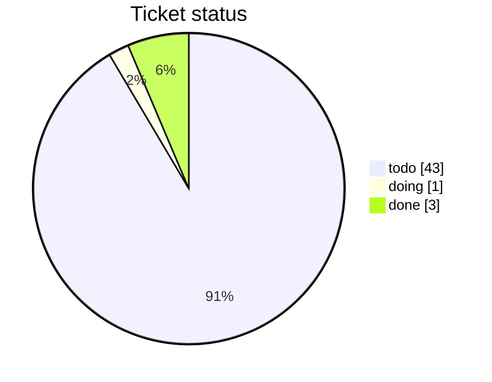
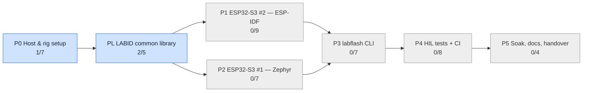
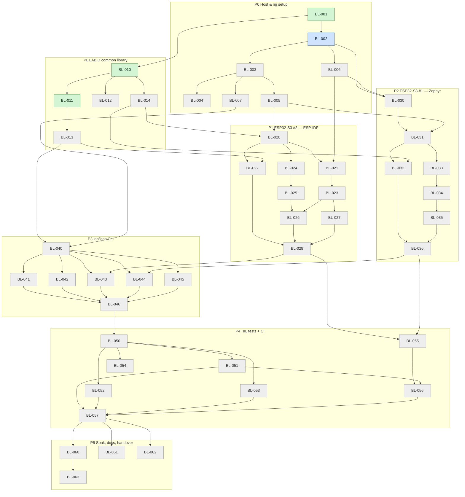

# bootlab-esp — Tickets & Progress

> Generated from `tickets.json` by `tickets_tool.py render`. **Do not edit by hand.**
> Plan reference: `PLAN.md`. Legend: ⬜ todo · 🔵 doing · 🟣 review · 🟥 blocked · ✅ done

## Overall

`██░░░░░░░░░░░░░░░░░░░░░░░░░░░░` **3/47 done (6%)**

## Epics

| Epic | Phase | Title | Progress | Done | Status | Plan |
|---|---|---|---|---|---|---|
| E0 | P0 | Host & rig setup | `██░░░░░░░░░░` | 1/7 | 🔵 doing | §2, §3, §8 P0 |
| EL | PL | LABID common library | `█████░░░░░░░` | 2/5 | 🔵 doing | §7.3, §8 PL |
| E1 | P1 | ESP32-S3 #2 — ESP-IDF | `░░░░░░░░░░░░` | 0/9 | ⬜ todo | §4.2, §5, §6, §7.2, §8 P1 |
| E2 | P2 | ESP32-S3 #1 — Zephyr | `░░░░░░░░░░░░` | 0/7 | ⬜ todo | §4.1, §5, §6, §7.1, §8 P2 |
| E3 | P3 | labflash CLI | `░░░░░░░░░░░░` | 0/7 | ⬜ todo | §8 P3 |
| E4 | P4 | HIL tests + CI | `░░░░░░░░░░░░` | 0/8 | ⬜ todo | §8 P4 |
| E5 | P5 | Soak, docs, handover | `░░░░░░░░░░░░` | 0/4 | ⬜ todo | §8 P5 |

## Epic dependency graph

## Ready to start now

- **BL-012** LABID parser fuzz target (S) — EL
- **BL-013** Python labid.py (S) — EL
- **BL-014** Packaging: Zephyr module + IDF component (S) — EL

## Tickets by epic

### E0 · P0 — Host & rig setup

| | ID | Title | Size | Boards | Depends on | PR |
|---|---|---|---|---|---|---|
| ✅ | BL-001 | Repo skeleton + pinned versions | S | host | — |  |
| 🔵 | BL-002 | Install toolchains on RPi4 | M | host | BL-001 |  |
| ⬜ | BL-003 | Powered USB hub, udev rules by serial, groups | S | host | BL-002 |  |
| ⬜ | BL-004 | Back up both ESP32-S3 boards | S | zephyr, idf | BL-003 |  |
| ⬜ | BL-005 | Detect board hardware → rig.yaml | S | zephyr, idf | BL-003 |  |
| ⬜ | BL-006 | Generate lab signing keys | S | host | BL-002 |  |
| ⬜ | BL-007 | labflash doctor (stub) | S | host | BL-003 |  |

✅ <b>BL-001</b> — Repo skeleton + pinned versions

- **Size:** S (≤ 0.5 day)  
- **Boards:** host  
- **Depends on:** —  
- **Plan:** §2, §3, §8 P0

Create the tree from PLAN §3. Pin Zephyr, IDF, MCUboot, ble_ota versions in scripts/versions.env.

**Acceptance criteria**
- [x] Tree matches PLAN §3
- [x] keys/, backups/, *.pem ignored by git
- [x] versions.env lists every pinned dependency

🔵 <b>BL-002</b> — Install toolchains on RPi4

- **Size:** M (1–2 days)  
- **Boards:** host  
- **Depends on:** BL-001  
- **Plan:** §2, §3, §8 P0

Python 3.11+, BlueZ, west + Zephyr SDK, ESP-IDF, imgtool, esptool.

**Acceptance criteria**
- [ ] scripts/check_env.sh prints all versions and exits 0
- [ ] Versions match versions.env

⬜ <b>BL-003</b> — Powered USB hub, udev rules by serial, groups

- **Size:** S (≤ 0.5 day)  
- **Boards:** host  
- **Depends on:** BL-002  
- **Plan:** §2, §3, §8 P0

Both boards share VID:PID; udev symlinks by USB serial. User in bluetooth, dialout, plugdev.

**Acceptance criteria**
- [ ] /dev/lab-esp-zephyr and /dev/lab-esp-idf exist
- [ ] Symlinks survive replug and port swap
- [ ] No brown-out resets over 10 min

⬜ <b>BL-004</b> — Back up both ESP32-S3 boards

- **Size:** S (≤ 0.5 day)  
- **Boards:** zephyr, idf  
- **Depends on:** BL-003  
- **Plan:** §2, §3, §8 P0

esptool read_flash of the current firmware before any erase.

**Acceptance criteria**
- [ ] 2 backup images in backups/
- [ ] docs/recovery.md has the restore command
- [ ] Nothing committed to git

⬜ <b>BL-005</b> — Detect board hardware → rig.yaml

- **Size:** S (≤ 0.5 day)  
- **Boards:** zephyr, idf  
- **Depends on:** BL-003  
- **Plan:** §2, §3, §8 P0

Flash size, PSRAM, board revision, RGB LED GPIO (48 or 38), USB serial per board.

**Acceptance criteria**
- [ ] host/config/rig.yaml filled for both boards
- [ ] LED GPIO confirmed by a quick blink

⬜ <b>BL-006</b> — Generate lab signing keys

- **Size:** S (≤ 0.5 day)  
- **Boards:** host  
- **Depends on:** BL-002  
- **Plan:** §2, §3, §8 P0

scripts/gen_keys.sh: zephyr_p256, idf_sbv2. Refuses to overwrite.

**Acceptance criteria**
- [ ] 2 keys in keys/
- [ ] Second run refuses to overwrite
- [ ] git status shows no key files

⬜ <b>BL-007</b> — labflash doctor (stub)

- **Size:** S (≤ 0.5 day)  
- **Boards:** host  
- **Depends on:** BL-003  
- **Plan:** §2, §3, §8 P0

Minimal environment check.

**Acceptance criteria**
- [ ] Reports 2 ESP USB devices, BT adapter, WiFi
- [ ] Non-zero exit on any missing item

### EL · PL — LABID common library

| | ID | Title | Size | Boards | Depends on | PR |
|---|---|---|---|---|---|---|
| ✅ | BL-010 | LABID C parser, writer, CRC-16 | M | common | BL-001 |  |
| ✅ | BL-011 | Golden test vectors + Unity tests | M | common | BL-010 |  |
| ⬜ | BL-012 | LABID parser fuzz target | S | common | BL-010 |  |
| ⬜ | BL-013 | Python labid.py | S | host | BL-011 |  |
| ⬜ | BL-014 | Packaging: Zephyr module + IDF component | S | common | BL-010 |  |

✅ <b>BL-010</b> — LABID C parser, writer, CRC-16

- **Size:** M (1–2 days)  
- **Boards:** common  
- **Depends on:** BL-001  
- **Plan:** §7.3, §8 PL

C99, no malloc, no RTOS calls, fixed buffers, provider callbacks.

**Acceptance criteria**
- [x] Implements PLAN §7.3
- [x] CRC('123456789') == 0x29B1
- [x] -Wall -Wextra -Werror clean

✅ <b>BL-011</b> — Golden test vectors + Unity tests

- **Size:** M (1–2 days)  
- **Boards:** common  
- **Depends on:** BL-010  
- **Plan:** §7.3, §8 PL

test_vectors.json: valid frames, bad CRC, too long, unknown keys, garbage.

**Acceptance criteria**
- [x] 100 % vectors pass
- [x] Coverage ≥ 90 % line + branch

⬜ <b>BL-012</b> — LABID parser fuzz target

- **Size:** S (≤ 0.5 day)  
- **Boards:** common  
- **Depends on:** BL-010  
- **Plan:** §7.3, §8 PL

libFuzzer + ASan/UBSan.

**Acceptance criteria**
- [ ] 10 min fuzz, 0 crashes, 0 sanitizer errors

⬜ <b>BL-013</b> — Python labid.py

- **Size:** S (≤ 0.5 day)  
- **Boards:** host  
- **Depends on:** BL-011  
- **Plan:** §7.3, §8 PL

Same framing + CRC in host/labflash/labid.py.

**Acceptance criteria**
- [ ] Passes the same test_vectors.json
- [ ] mypy clean

⬜ <b>BL-014</b> — Packaging: Zephyr module + IDF component

- **Size:** S (≤ 0.5 day)  
- **Boards:** common  
- **Depends on:** BL-010  
- **Plan:** §7.3, §8 PL

One source, two build integrations.

**Acceptance criteria**
- [ ] Builds for Zephyr native_sim and IDF linux target

### E1 · P1 — ESP32-S3 #2 — ESP-IDF

| | ID | Title | Size | Boards | Depends on | PR |
|---|---|---|---|---|---|---|
| ⬜ | BL-020 | IDF blink app + toggles + 5 variants + task WDT | M | idf | BL-005, BL-014 |  |
| ⬜ | BL-021 | IDF partitions + signing + rollback config | S | idf | BL-020, BL-006 |  |
| ⬜ | BL-022 | IDF LABID port on USB-Serial-JTAG | S | idf | BL-020, BL-013 |  |
| ⬜ | BL-023 | IDF self-test + mark valid | S | idf | BL-021 |  |
| ⬜ | BL-024 | IDF WiFi + token provisioning via NVS | S | idf | BL-020 |  |
| ⬜ | BL-025 | IDF HTTPS control server (/ota, /version) | M | idf | BL-024 |  |
| ⬜ | BL-026 | IDF WiFi OTA (esp_https_ota pull) | M | idf | BL-025, BL-023 |  |
| ⬜ | BL-027 | IDF BLE OTA (ble_ota + NimBLE + coexistence) | L | idf | BL-023 |  |
| ⬜ | BL-028 | IDF phase acceptance run | S | idf | BL-022, BL-026, BL-027 |  |

⬜ <b>BL-020</b> — IDF blink app + toggles + 5 variants + task WDT

- **Size:** M (1–2 days)  
- **Boards:** idf  
- **Depends on:** BL-005, BL-014  
- **Plan:** §4.2, §5, §6, §7.2, §8 P1

FreeRTOS blink task (led_strip), toggles counter, variants per PLAN §5.3, CONFIG_ESP_TASK_WDT_PANIC.

**Acceptance criteria**
- [ ] All 5 variants build
- [ ] v1 blinks 1 Hz
- [ ] hang variant resets within 10 s

⬜ <b>BL-021</b> — IDF partitions + signing + rollback config

- **Size:** S (≤ 0.5 day)  
- **Boards:** idf  
- **Depends on:** BL-020, BL-006  
- **Plan:** §4.2, §5, §6, §7.2, §8 P1

partitions.csv (§4.2), sdkconfig.defaults (§6). No eFuse writes.

**Acceptance criteria**
- [ ] Signed build succeeds
- [ ] Forbidden-config grep passes
- [ ] efuse-summary unchanged after flash

⬜ <b>BL-022</b> — IDF LABID port on USB-Serial-JTAG

- **Size:** S (≤ 0.5 day)  
- **Boards:** idf  
- **Depends on:** BL-020, BL-013  
- **Plan:** §4.2, §5, §6, §7.2, §8 P1

Driver read task, app/bootloader descriptions, OTA state.

**Acceptance criteria**
- [ ] ANNOUNCE ≤ 2 s after reset
- [ ] ID?, VER?, STATE? ≤ 100 ms
- [ ] Garbage input → ERR, no reset

⬜ <b>BL-023</b> — IDF self-test + mark valid

- **Size:** S (≤ 0.5 day)  
- **Boards:** idf  
- **Depends on:** BL-021  
- **Plan:** §4.2, §5, §6, §7.2, §8 P1

5 s health check then esp_ota_mark_app_valid_cancel_rollback().

**Acceptance criteria**
- [ ] VER? confirmed=1 after 5 s
- [ ] no_confirm stays confirmed=0

⬜ <b>BL-024</b> — IDF WiFi + token provisioning via NVS

- **Size:** S (≤ 0.5 day)  
- **Boards:** idf  
- **Depends on:** BL-020  
- **Plan:** §4.2, §5, §6, §7.2, §8 P1

labflash provision idf writes SSID/PSK/token over USB.

**Acceptance criteria**
- [ ] Board joins WiFi after reboot
- [ ] No credentials in source or logs

⬜ <b>BL-025</b> — IDF HTTPS control server (/ota, /version)

- **Size:** M (1–2 days)  
- **Boards:** idf  
- **Depends on:** BL-024  
- **Plan:** §4.2, §5, §6, §7.2, §8 P1

Bearer token, RPi4 self-signed CA pinned.

**Acceptance criteria**
- [ ] GET /version matches LABID VER.app
- [ ] Wrong token → 401

⬜ <b>BL-026</b> — IDF WiFi OTA (esp_https_ota pull)

- **Size:** M (1–2 days)  
- **Boards:** idf  
- **Depends on:** BL-025, BL-023  
- **Plan:** §4.2, §5, §6, §7.2, §8 P1

Pull from RPi4 HTTPS server, signature check on update.

**Acceptance criteria**
- [ ] v1 → v2 over WiFi, 4 Hz, confirmed=1
- [ ] bad_sig rejected, v1 keeps running

⬜ <b>BL-027</b> — IDF BLE OTA (ble_ota + NimBLE + coexistence)

- **Size:** L (3–5 days)  
- **Boards:** idf  
- **Depends on:** BL-023  
- **Plan:** §4.2, §5, §6, §7.2, §8 P1

esp-iot-solution ble_ota, NimBLE host, SW coexistence.

**Acceptance criteria**
- [ ] v2 → v1 over BLE
- [ ] WiFi stays connected during BLE OTA
- [ ] Interrupted transfer → old image still running

⬜ <b>BL-028</b> — IDF phase acceptance run

- **Size:** S (≤ 0.5 day)  
- **Boards:** idf  
- **Depends on:** BL-022, BL-026, BL-027  
- **Plan:** §4.2, §5, §6, §7.2, §8 P1

Run all P1 acceptance checks.

**Acceptance criteria**
- [ ] All P1 checkboxes ticked with logs in the PR

### E2 · P2 — ESP32-S3 #1 — Zephyr

| | ID | Title | Size | Boards | Depends on | PR |
|---|---|---|---|---|---|---|
| ⬜ | BL-030 | Zephyr west + sysbuild MCUboot + swap-with-revert check | M | zephyr | BL-002, BL-006 |  |
| ⬜ | BL-031 | Zephyr blink app + toggles + 5 variants + watchdog | M | zephyr | BL-030, BL-005 |  |
| ⬜ | BL-032 | Zephyr LABID port on console | S | zephyr | BL-031, BL-014 |  |
| ⬜ | BL-033 | Zephyr self-test + confirm + twister tests | S | zephyr | BL-031 |  |
| ⬜ | BL-034 | Zephyr mcumgr SMP over BLE | M | zephyr | BL-033 |  |
| ⬜ | BL-035 | Zephyr WiFi + SMP over UDP (single build with BT) | L | zephyr | BL-034 |  |
| ⬜ | BL-036 | Zephyr phase acceptance run | S | zephyr | BL-032, BL-035 |  |

⬜ <b>BL-030</b> — Zephyr west + sysbuild MCUboot + swap-with-revert check

- **Size:** M (1–2 days)  
- **Boards:** zephyr  
- **Depends on:** BL-002, BL-006  
- **Plan:** §4.1, §5, §6, §7.1, §8 P2

FIRST ticket for Zephyr. Verify revert-capable swap mode on ESP32-S3.

**Acceptance criteria**
- [ ] MCUboot + hello app boot on the board
- [ ] Swap mode decision written in PLAN §4.1
- [ ] ESCALATE to owner if only overwrite-only exists

⬜ <b>BL-031</b> — Zephyr blink app + toggles + 5 variants + watchdog

- **Size:** M (1–2 days)  
- **Boards:** zephyr  
- **Depends on:** BL-030, BL-005  
- **Plan:** §4.1, §5, §6, §7.1, §8 P2

LED strip driver (verify WS2812 backend), toggles, variants, hardware watchdog.

**Acceptance criteria**
- [ ] All 5 variants build and sign
- [ ] v1 blinks 1 Hz
- [ ] hang variant resets within 10 s

⬜ <b>BL-032</b> — Zephyr LABID port on console

- **Size:** S (≤ 0.5 day)  
- **Boards:** zephyr  
- **Depends on:** BL-031, BL-014  
- **Plan:** §4.1, §5, §6, §7.1, §8 P2

Console device (USB-Serial-JTAG), irq RX, hwinfo UID, boot API, shell off.

**Acceptance criteria**
- [ ] ANNOUNCE ≤ 2 s
- [ ] ID?, VER?, STATE? ≤ 100 ms
- [ ] 1 000 requests under heavy logging, 0 corrupt

⬜ <b>BL-033</b> — Zephyr self-test + confirm + twister tests

- **Size:** S (≤ 0.5 day)  
- **Boards:** zephyr  
- **Depends on:** BL-031  
- **Plan:** §4.1, §5, §6, §7.1, §8 P2

boot_write_img_confirmed() after 5 s; native_sim tests with mocked boot API.

**Acceptance criteria**
- [ ] twister passes
- [ ] confirmed=1 on board after 5 s

⬜ <b>BL-034</b> — Zephyr mcumgr SMP over BLE

- **Size:** M (1–2 days)  
- **Boards:** zephyr  
- **Depends on:** BL-033  
- **Plan:** §4.1, §5, §6, §7.1, §8 P2

MCUMGR image + os groups over BT.

**Acceptance criteria**
- [ ] v1 → v2 over BLE, confirmed
- [ ] no_confirm and hang revert
- [ ] bad_sig refused by MCUboot

⬜ <b>BL-035</b> — Zephyr WiFi + SMP over UDP (single build with BT)

- **Size:** L (3–5 days)  
- **Boards:** zephyr  
- **Depends on:** BL-034  
- **Plan:** §4.1, §5, §6, §7.1, §8 P2

WiFi STA, DHCP, UDP SMP port 1337.

**Acceptance criteria**
- [ ] v2 → v1 over UDP
- [ ] One build with BT + WiFi, OR documented reason + 2 variants + owner decision

⬜ <b>BL-036</b> — Zephyr phase acceptance run

- **Size:** S (≤ 0.5 day)  
- **Boards:** zephyr  
- **Depends on:** BL-032, BL-035  
- **Plan:** §4.1, §5, §6, §7.1, §8 P2

Run all P2 acceptance checks.

**Acceptance criteria**
- [ ] All P2 checkboxes ticked with logs in the PR

### E3 · P3 — labflash CLI

| | ID | Title | Size | Boards | Depends on | PR |
|---|---|---|---|---|---|---|
| ⬜ | BL-040 | labflash core: config, UID resolution, re-enumeration wait | M | host | BL-013, BL-007 |  |
| ⬜ | BL-041 | identify, info, status, measure | S | host | BL-040 |  |
| ⬜ | BL-042 | flash, recover, provision (USB) | S | host | BL-040 |  |
| ⬜ | BL-043 | update idf --transport ble|wifi | M | host, idf | BL-040, BL-028 |  |
| ⬜ | BL-044 | update zephyr --transport ble|udp | M | host, zephyr | BL-040, BL-036 |  |
| ⬜ | BL-045 | build + sign orchestration | S | host | BL-040 |  |
| ⬜ | BL-046 | labflash mocked unit tests | M | host | BL-041, BL-042, BL-043, BL-044, BL-045 |  |

⬜ <b>BL-040</b> — labflash core: config, UID resolution, re-enumeration wait

- **Size:** M (1–2 days)  
- **Boards:** host  
- **Depends on:** BL-013, BL-007  
- **Plan:** §8 P3

rig.yaml, resolve ports by UID, wait ≤ 5 s after resets, --json.

**Acceptance criteria**
- [ ] Never reuses stale ttyACMx
- [ ] Clear error on missing or swapped board

⬜ <b>BL-041</b> — identify, info, status, measure

- **Size:** S (≤ 0.5 day)  
- **Boards:** host  
- **Depends on:** BL-040  
- **Plan:** §8 P3

LABID discovery, cross-check, toggle-based Hz.

**Acceptance criteria**
- [ ] identify maps both boards
- [ ] measure within ± 1 toggle over 5 s

⬜ <b>BL-042</b> — flash, recover, provision (USB)

- **Size:** S (≤ 0.5 day)  
- **Boards:** host  
- **Depends on:** BL-040  
- **Plan:** §8 P3

esptool / west / idf.py wrappers with identity check before writing.

**Acceptance criteria**
- [ ] Factory flash both boards
- [ ] Refuses to flash if board= mismatches

⬜ <b>BL-043</b> — update idf --transport ble|wifi

- **Size:** M (1–2 days)  
- **Boards:** host, idf  
- **Depends on:** BL-040, BL-028  
- **Plan:** §8 P3

Python ble_ota client + HTTPS trigger + local HTTPS server.

**Acceptance criteria**
- [ ] Both transports update and verify via LABID

⬜ <b>BL-044</b> — update zephyr --transport ble|udp

- **Size:** M (1–2 days)  
- **Boards:** host, zephyr  
- **Depends on:** BL-040, BL-036  
- **Plan:** §8 P3

SMP client over BLE and UDP.

**Acceptance criteria**
- [ ] Both transports update, SMP version == LABID version

⬜ <b>BL-045</b> — build + sign orchestration

- **Size:** S (≤ 0.5 day)  
- **Boards:** host  
- **Depends on:** BL-040  
- **Plan:** §8 P3

labflash build <board|all> --variant.

**Acceptance criteria**
- [ ] Builds all 10 images (2 boards × 5 variants)

⬜ <b>BL-046</b> — labflash mocked unit tests

- **Size:** M (1–2 days)  
- **Boards:** host  
- **Depends on:** BL-041, BL-042, BL-043, BL-044, BL-045  
- **Plan:** §8 P3

pytest with mocked BLE / serial / HTTP.

**Acceptance criteria**
- [ ] Line coverage ≥ 80 %
- [ ] ruff + mypy clean

### E4 · P4 — HIL tests + CI

| | ID | Title | Size | Boards | Depends on | PR |
|---|---|---|---|---|---|---|
| ⬜ | BL-050 | HIL framework: fixtures, markers, artifacts | M | host | BL-046 |  |
| ⬜ | BL-051 | HIL T01–T03 boot + update | S | zephyr, idf | BL-050 |  |
| ⬜ | BL-052 | HIL T04–T09 rollback, security, robustness | M | zephyr, idf | BL-050 |  |
| ⬜ | BL-053 | HIL T10–T15 LABID + identity + USB | S | zephyr, idf | BL-050 |  |
| ⬜ | BL-054 | (Stretch) HIL T17 power cut | M | zephyr, idf | BL-050 |  |
| ⬜ | BL-055 | build.yml cloud CI | M | host | BL-028, BL-036 |  |
| ⬜ | BL-056 | hil.yml self-hosted runner on RPi4 | M | host | BL-055, BL-051 |  |
| ⬜ | BL-057 | Full HIL suite green 3× in a row | S | zephyr, idf | BL-051, BL-052, BL-053, BL-056 |  |

⬜ <b>BL-050</b> — HIL framework: fixtures, markers, artifacts

- **Size:** M (1–2 days)  
- **Boards:** host  
- **Depends on:** BL-046  
- **Plan:** §8 P4

rig fixture, factory_reset, btmon capture, JUnit.

**Acceptance criteria**
- [ ] Dummy HIL test runs on both boards and restores v1

⬜ <b>BL-051</b> — HIL T01–T03 boot + update

- **Size:** S (≤ 0.5 day)  
- **Boards:** zephyr, idf  
- **Depends on:** BL-050  
- **Plan:** §8 P4

PLAN §8 P4 matrix.

**Acceptance criteria**
- [ ] Green on all board/transport combinations

⬜ <b>BL-052</b> — HIL T04–T09 rollback, security, robustness

- **Size:** M (1–2 days)  
- **Boards:** zephyr, idf  
- **Depends on:** BL-050  
- **Plan:** §8 P4

no_confirm, hang, bad_sig, corrupt, interrupted, token.

**Acceptance criteria**
- [ ] Green on all combinations

⬜ <b>BL-053</b> — HIL T10–T15 LABID + identity + USB

- **Size:** S (≤ 0.5 day)  
- **Boards:** zephyr, idf  
- **Depends on:** BL-050  
- **Plan:** §8 P4

identify, UID stability, version consistency, ERR, heavy logging, 50 resets.

**Acceptance criteria**
- [ ] All green

⬜ <b>BL-054</b> — (Stretch) HIL T17 power cut

- **Size:** M (1–2 days)  
- **Boards:** zephyr, idf  
- **Depends on:** BL-050  
- **Plan:** §8 P4

Needs per-port switchable hub.

**Acceptance criteria**
- [ ] Recovers every run, or skipped if no hub

⬜ <b>BL-055</b> — build.yml cloud CI

- **Size:** M (1–2 days)  
- **Boards:** host  
- **Depends on:** BL-028, BL-036  
- **Plan:** §8 P4

Builds, unit tests, fuzz smoke, forbidden-config grep, CI test keys.

**Acceptance criteria**
- [ ] Green on main
- [ ] Signed artifacts uploaded

⬜ <b>BL-056</b> — hil.yml self-hosted runner on RPi4

- **Size:** M (1–2 days)  
- **Boards:** host  
- **Depends on:** BL-055, BL-051  
- **Plan:** §8 P4

Private repo, dedicated runner user, concurrency: hil.

**Acceptance criteria**
- [ ] HIL job runs on PR
- [ ] Runner has no sudo and no access to keys/

⬜ <b>BL-057</b> — Full HIL suite green 3× in a row

- **Size:** S (≤ 0.5 day)  
- **Boards:** zephyr, idf  
- **Depends on:** BL-051, BL-052, BL-053, BL-056  
- **Plan:** §8 P4

Stability gate.

**Acceptance criteria**
- [ ] 3 consecutive green runs
- [ ] Runtime documented

### E5 · P5 — Soak, docs, handover

| | ID | Title | Size | Boards | Depends on | PR |
|---|---|---|---|---|---|---|
| ⬜ | BL-060 | Overnight soak ×100 | S | zephyr, idf | BL-057 |  |
| ⬜ | BL-061 | README quick start | S | host | BL-057 |  |
| ⬜ | BL-062 | Recovery runbook + adding-a-board guide | S | host | BL-057 |  |
| ⬜ | BL-063 | Final PLAN.md update | S | host | BL-060 |  |

⬜ <b>BL-060</b> — Overnight soak ×100

- **Size:** S (≤ 0.5 day)  
- **Boards:** zephyr, idf  
- **Depends on:** BL-057  
- **Plan:** §8 P5

T16 repeated per board/transport.

**Acceptance criteria**
- [ ] Pass rate ≥ 99 %
- [ ] Root cause logged for every failure

⬜ <b>BL-061</b> — README quick start

- **Size:** S (≤ 0.5 day)  
- **Boards:** host  
- **Depends on:** BL-057  
- **Plan:** §8 P5

< 5 min from clone to first OTA.

**Acceptance criteria**
- [ ] Fresh clone reaches T02 green following README only

⬜ <b>BL-062</b> — Recovery runbook + adding-a-board guide

- **Size:** S (≤ 0.5 day)  
- **Boards:** host  
- **Depends on:** BL-057  
- **Plan:** §8 P5

docs/recovery.md, docs/adding-a-board.md.

**Acceptance criteria**
- [ ] Recovery tested once per board from the docs

⬜ <b>BL-063</b> — Final PLAN.md update

- **Size:** S (≤ 0.5 day)  
- **Boards:** host  
- **Depends on:** BL-060  
- **Plan:** §8 P5

Pinned versions, Zephyr partitions, deviations.

**Acceptance criteria**
- [ ] PLAN.md matches the delivered repo

## Full ticket dependency graph

Show graph

## Workflow rules for the agent

1. Pick only tickets from **Ready to start now**.
2. `python3 tickets_tool.py set BL-xxx doing` when starting.
3. One branch + one PR per ticket: `bl-xxx-short-title`. PR body copies the acceptance criteria with evidence.
4. `set BL-xxx review --pr <url>` when the PR is open; `set BL-xxx done` after merge.
5. `set BL-xxx blocked --pr <issue-or-note-url>` when an ESCALATE condition triggers; stop and ask the owner.
6. Commit `tickets.json` and `TICKETS.md` together with each status change.
